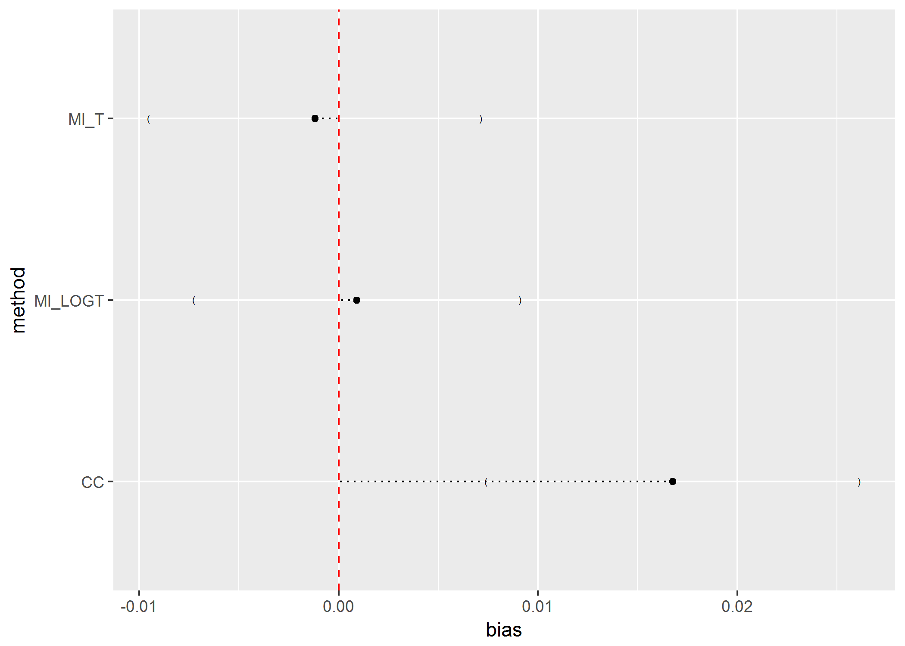
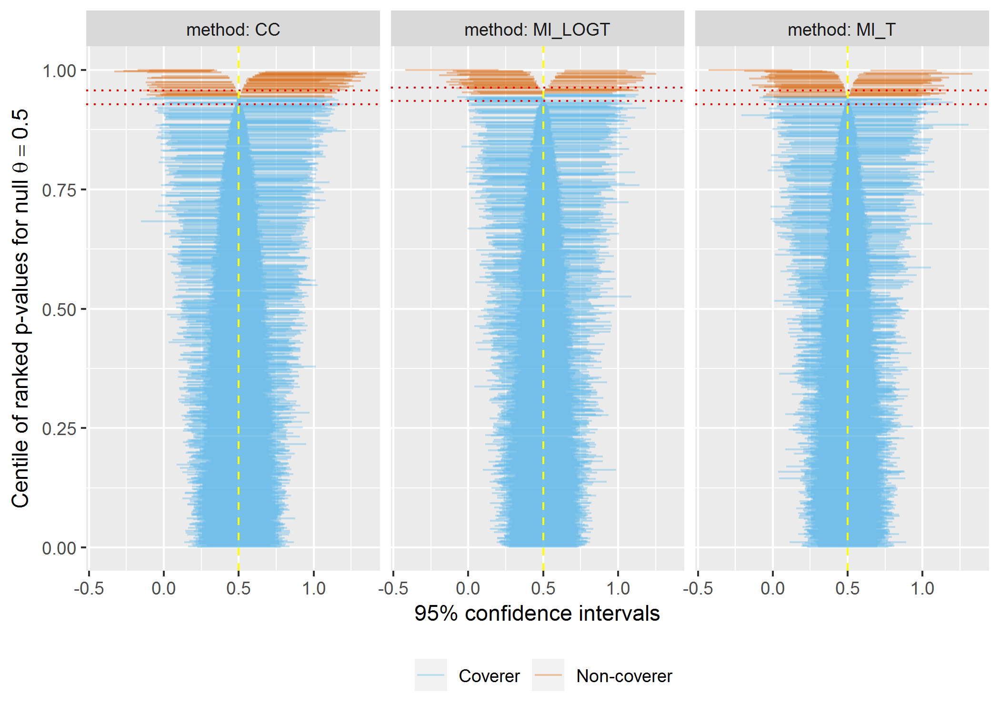
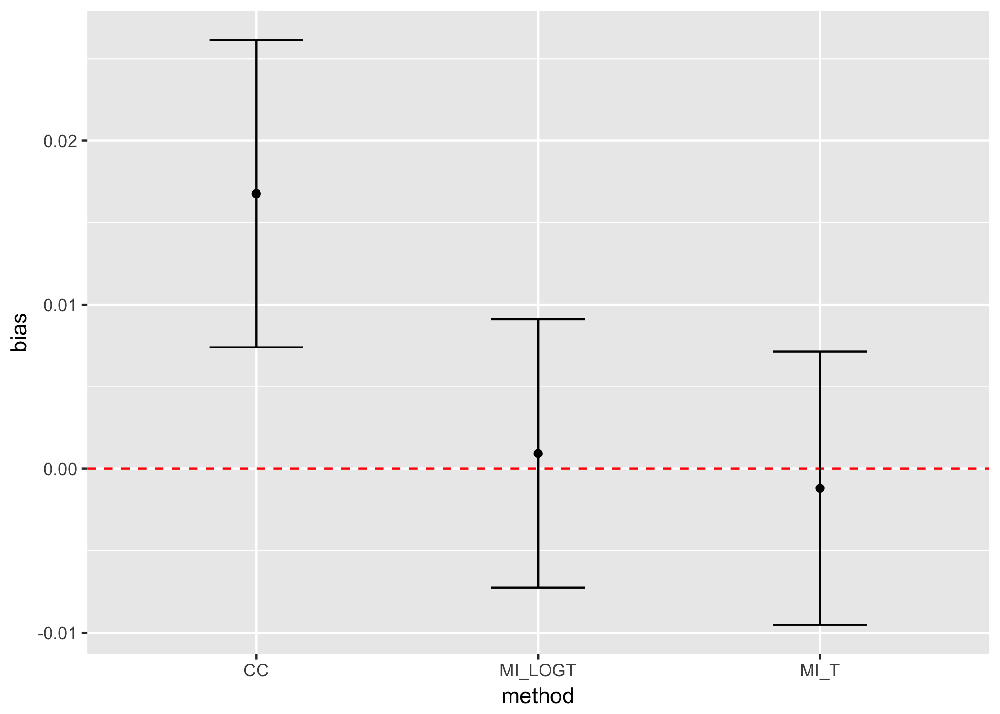
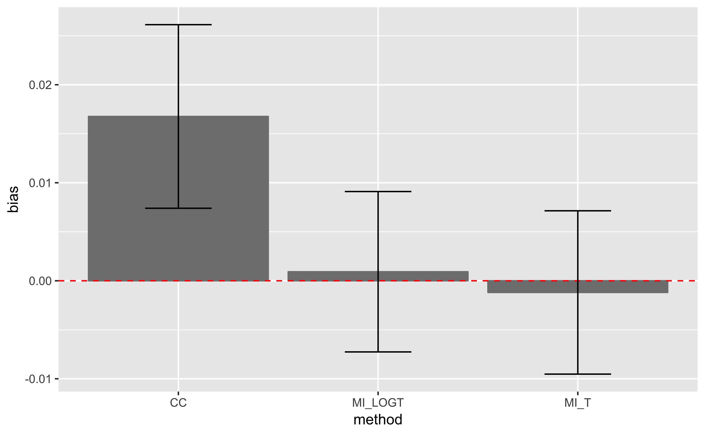

<!-- README.md is generated from README.Rmd. Please edit that file -->

# rsimsum 

[](https://travis-ci.org/ellessenne/rsimsum)
[](https://ci.appveyor.com/project/ellessenne/rsimsum)
[](https://codecov.io/github/ellessenne/rsimsum?branch=master)
[](https://cran.r-project.org/package=rsimsum)
[](https://cran.r-project.org/package=rsimsum)
[](https://cran.r-project.org/package=rsimsum)
[](https://doi.org/10.21105/joss.00739)[](https://zenodo.org/badge/latestdoi/92379170)
[](http://makeapullrequest.com)

`rsimsum` is an R package that can compute summary statistics from
simulation studies. `rsimsum` is modelled upon a similar package
available in Stata, the user-written command `simsum` (White I.R.,
2010).

The aim of `rsimsum` is to help to report simulation studies, including
understanding the role of chance in results of simulation studies: Monte
Carlo standard errors and confidence intervals based on them are
computed and presented to the user by default. `rsimsum` can compute a
wide variety of summary statistics: bias, empirical and model-based
standard errors, relative precision, relative error in model standard
error, mean squared error, coverage, bias. Further details on each
summary statistic are presented elsewhere (White I.R., 2010; Morris *et
al*, 2017).

The main function of `rsimsum` is called `simsum` and can handle
simulation studies with a single estimand of interest at a time. Missing
values are excluded by default, and it is possible to define boundary
values to drop estimated values or standard errors exceeding such
limits. It is possible to define a variable representing methods
compared with the simulation study, and it is possible to define *by*
factors, that is, factors that vary between the different simulated
scenarios (data-generating mechanisms, DGMs). However, methods and DGMs
are not strictly required: in that case, a simulation study with a
single scenario and a single method is assumed. Finally, `rsimsum`
provides a function named `multisimsum` that allows summarising
simulation studies with multiple estimands as well.

An important step of reporting a simulation study consists in
visualising the results; therefore, `rsimsum` exploits the R package
[`ggplot2`](https://CRAN.R-project.org/package=ggplot2) to produce a
portfolio of opinionated data visualisations for quick exploration of
results, inferring colours and facetting by data-generating mechanisms.
`rsimsum` includes methods to produce (1) plots of summary statistics
with confidence intervals based on Monte Carlo standard errors (forest
plots, bar plots, and lolly plots), (2) zip plots to graphically
visualise coverage by directly plotting confidence intervals, and (3)
heat plots. The latter is a visualisation type that has not been
traditionally used to present results of simulation studies, and
consists in a mosaic plot where the factor on the x-axis is the methods
compared with the current simulation study and the factor on the y-axis
is one of the data-generating factors, as selected by the user. Each
tile of the mosaic plot is coloured according to the value of the
summary statistic of interest, with a red colour representing values
above the target value and a blue colour representing values below the
target.

## Installation

You can install `rsimsum` from CRAN:

``` r
install.packages("rsimsum")
```

Alternatively, it is possible to install the development version from
GitHub via:

``` r
# install.packages("devtools")
devtools::install_github("ellessenne/rsimsum")
```

## Example

This is a basic example using data from a simulation study on missing
data (type `help("MIsim", package = "rsimsum")` in the R console for
more information):

``` r
library(rsimsum)
#> 
#> Attaching package: 'rsimsum'
#> The following object is masked from 'package:utils':
#> 
#>     zip
data("MIsim", package = "rsimsum")
s <- simsum(data = MIsim, estvarname = "b", true = 0.5, se = "se", methodvar = "method")
#> `ref` was not specified, CC set as the reference
s
#> 
#> Call:
#>  simsum(data = MIsim, estvarname = "b", true = 0.5, se = "se", 
#>     methodvar = "method")
#> 
#> Method variable: method 
#>  Unique methods: CC, MI_LOGT, MI_T 
#>  Reference method: CC 
#> 
#> By factors: none
#> 
#> Monte Carlo standard errors were computed.
```

Summarising the results:

``` r
summary(s)
#> 
#> Call:
#>  simsum(data = MIsim, estvarname = "b", true = 0.5, se = "se", 
#>     methodvar = "method")
#> 
#> Method variable: method 
#>  Unique methods: CC, MI_LOGT, MI_T 
#>  Reference method: CC 
#> By factors: none
#> 
#> Summary statistics:
#> 
#>  Method = CC 
#>                                              Estimate   MCSE Lower 2.5% Upper 97.5%
#>  Simulations with non-missing estimates/SEs 1000.0000     NA         NA          NA
#>                      Average point estimate    0.5168     NA         NA          NA
#>                       Median point estimate    0.5070     NA         NA          NA
#>                      Average standard error    0.0216     NA         NA          NA
#>                       Median standard error    0.0211     NA         NA          NA
#>                      Bias in point estimate    0.0168 0.0048     0.0074      0.0261
#>                    Empirical standard error    0.1511 0.0034     0.1445      0.1577
#>                          Mean squared error    0.0231 0.0011     0.0209      0.0253
#>   % gain in precision relative to method CC    1.0000 0.0000     1.0000      1.0000
#>                  Model-based standard error    0.1471 0.0005     0.1461      0.1481
#>          Relative % error in standard error   -2.6594 2.2049    -6.9810      1.6622
#>                  Coverage of nominal 95% CI    0.9430 0.0073     0.9286      0.9574
#>   Bias corrected coverage of nominal 95% CI    0.9400 0.0075     0.9253      0.9547
#>                      Power of 5% level test    0.9460 0.0071     0.9320      0.9600
#> 
#>  Method = MI_LOGT 
#>                                              Estimate   MCSE Lower 2.5% Upper 97.5%
#>  Simulations with non-missing estimates/SEs 1000.0000     NA         NA          NA
#>                      Average point estimate    0.5009     NA         NA          NA
#>                       Median point estimate    0.4969     NA         NA          NA
#>                      Average standard error    0.0182     NA         NA          NA
#>                       Median standard error    0.0172     NA         NA          NA
#>                      Bias in point estimate    0.0009 0.0042    -0.0073      0.0091
#>                    Empirical standard error    0.1320 0.0030     0.1262      0.1378
#>                          Mean squared error    0.0174 0.0009     0.0157      0.0191
#>   % gain in precision relative to method CC    1.3105 0.0394     1.2333      1.3876
#>                  Model-based standard error    0.1349 0.0006     0.1338      0.1361
#>          Relative % error in standard error    2.2233 2.3318    -2.3469      6.7935
#>                  Coverage of nominal 95% CI    0.9490 0.0070     0.9354      0.9626
#>   Bias corrected coverage of nominal 95% CI    0.9490 0.0070     0.9354      0.9626
#>                      Power of 5% level test    0.9690 0.0055     0.9583      0.9797
#> 
#>  Method = MI_T 
#>                                              Estimate   MCSE Lower 2.5% Upper 97.5%
#>  Simulations with non-missing estimates/SEs 1000.0000     NA         NA          NA
#>                      Average point estimate    0.4988     NA         NA          NA
#>                       Median point estimate    0.4939     NA         NA          NA
#>                      Average standard error    0.0179     NA         NA          NA
#>                       Median standard error    0.0169     NA         NA          NA
#>                      Bias in point estimate   -0.0012 0.0043    -0.0095      0.0071
#>                    Empirical standard error    0.1344 0.0030     0.1285      0.1403
#>                          Mean squared error    0.0181 0.0009     0.0163      0.0198
#>   % gain in precision relative to method CC    1.2637 0.0384     1.1884      1.3390
#>                  Model-based standard error    0.1338 0.0006     0.1327      0.1350
#>          Relative % error in standard error   -0.4412 2.2690    -4.8883      4.0059
#>                  Coverage of nominal 95% CI    0.9430 0.0073     0.9286      0.9574
#>   Bias corrected coverage of nominal 95% CI    0.9430 0.0073     0.9286      0.9574
#>                      Power of 5% level test    0.9630 0.0060     0.9513      0.9747
```

## Vignettes

`rsimsum` comes with 4 vignettes. In particular, check out the
introductory one:

``` r
vignette(topic = "introduction", package = "rsimsum")
```

## Visualising results

As of version `0.2.0`, `rsimsum` can produce a variety of
plots:

``` r
s <- simsum(data = MIsim, estvarname = "b", true = 0.5, se = "se", methodvar = "method", x = TRUE)
#> `ref` was not specified, CC set as the reference
pattern(s)
```


``` r
lolly(s, sstat = "bias")
```



``` r
zip(s)
```



As of version `0.3.0`, forest plots and bar plots are supported too as
alternatives to lolly
plots:

``` r
forest(s, sstat = "bias")
```



``` r
bar(s, sstat = "bias")
```



More info on the vignette dedicated to plotting:

``` r
vignette(topic = "plotting", package = "rsimsum")
```

# Citation

If you find `rsimsum` useful, please cite it in your publications:

``` r
citation("rsimsum")
#> 
#> To cite the rsimsum package in publications, please use:
#> 
#>   Gasparini, (2018). rsimsum: Summarise results from Monte Carlo simulation studies.
#>   Journal of Open Source Software, 3(26), 739, https://doi.org/10.21105/joss.00739
#> 
#> A BibTeX entry for LaTeX users is
#> 
#>   @Article{,
#>     author = {Alessandro Gasparini},
#>     title = {rsimsum: Summarise results from Monte Carlo simulation studies},
#>     journal = {Journal of Open Source Software},
#>     year = {2018},
#>     volume = {3},
#>     issue = {26},
#>     pages = {739},
#>     doi = {10.21105/joss.00739},
#>     url = {https://doi.org/10.21105/joss.00739},
#>   }
```

# References

  - White, I.R. 2010. *simsum: Analyses of simulation studies including
    Monte Carlo error*. The Stata Journal 10(3): 369-385
    \<<http://www.stata-journal.com/article.html?article=st0200>\>
  - Morris, T.P., White, I.R. and Crowther, M.J. 2017. *Using simulation
    studies to evaluate statistical methods*.
    \<[arXiv:1712.03198](https://arxiv.org/abs/1712.03198)\>
  - Gasparini, A. 2018. *rsimsum: Summarise results from Monte Carlo
    simulation studies*. Journal of Open Source Software, 3(26):739
    \<[10.21105/joss.00739](https://doi.org/10.21105/joss.00739)\>

# Warning for RStudio users

If you use RStudio and equations are not displayed properly within the
RStudio viewer window, please access the vignette from [the CRAN
website](https://cran.rstudio.com/web/packages/rsimsum/) or directly
from the R console with the command:

``` r
vignette(topic = "introduction", package = "rsimsum")
```

This is a known issue with RStudio (see
[\#2253](https://github.com/rstudio/rstudio/issues/2253)).

# Copyright

The icon for the hex sticker was made by
[Freepik](http://www.freepik.com) from
[Flaticon](https://www.flaticon.com) and is licensed by [CC 3.0
BY](http://creativecommons.org/licenses/by/3.0/).
