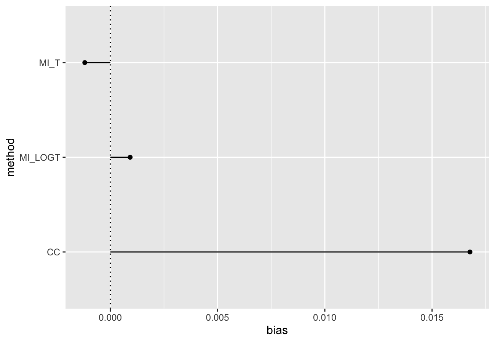
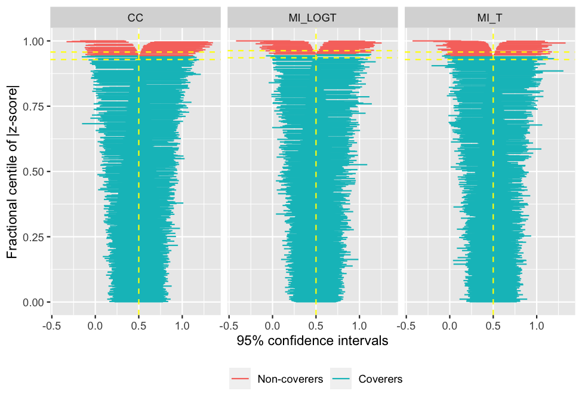
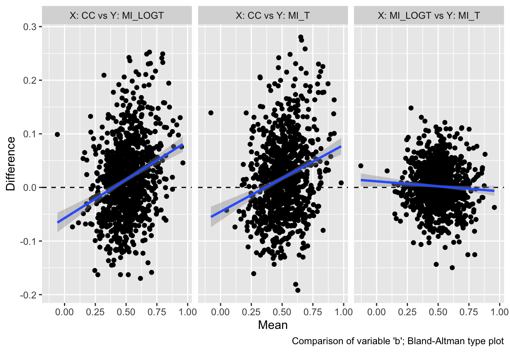
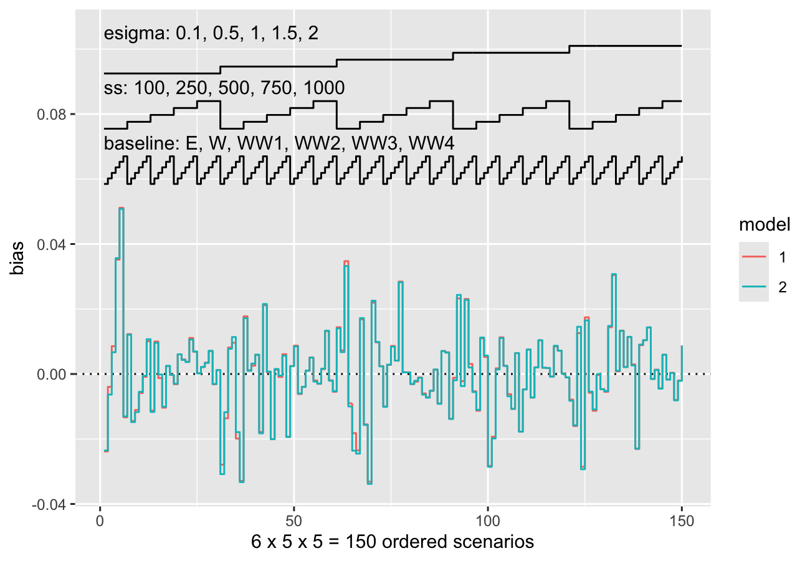
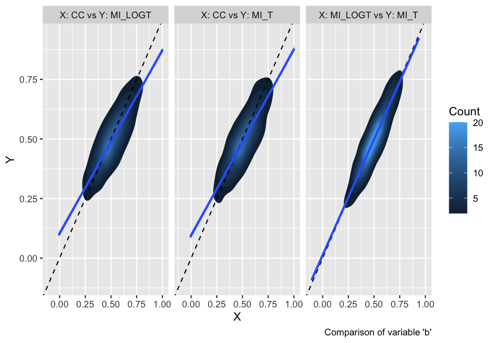
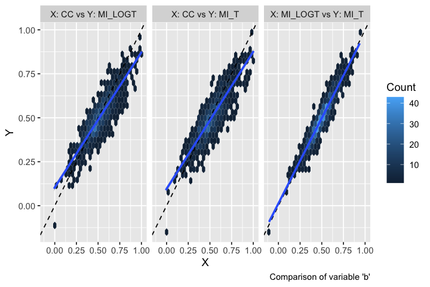

<!-- README.md is generated from README.Rmd. Please edit that file -->

# rsimsum 

<!-- badges: start -->

[](https://github.com/ellessenne/rsimsum/actions)
[](https://codecov.io/gh/ellessenne/rsimsum?branch=master)
[](https://cran.r-project.org/package=rsimsum)
[](https://cran.r-project.org/package=rsimsum)
[](https://cran.r-project.org/package=rsimsum)
[](https://doi.org/10.21105/joss.00739)
[](http://makeapullrequest.com)
<!-- badges: end -->

`rsimsum` is an R package that can compute summary statistics from
simulation studies. `rsimsum` is modelled upon a similar package
available in Stata, the user-written command `simsum` (White I.R.,
2010).

The aim of `rsimsum` is to help to report simulation studies, including
understanding the role of chance in results of simulation studies: Monte
Carlo standard errors and confidence intervals based on them are
computed and presented to the user by default. `rsimsum` can compute a
wide variety of summary statistics: bias, empirical and model-based
standard errors, relative precision, relative error in model standard
error, mean squared error, coverage, bias. Further details on each
summary statistic are presented elsewhere (White I.R., 2010; Morris *et
al*, 2019).

The main function of `rsimsum` is called `simsum` and can handle
simulation studies with a single estimand of interest at a time. Missing
values are excluded by default, and it is possible to define boundary
values to drop estimated values or standard errors exceeding such
limits. It is possible to define a variable representing methods
compared with the simulation study, and it is possible to define *by*
factors, that is, factors that vary between the different simulated
scenarios (data-generating mechanisms, DGMs). However, methods and DGMs
are not strictly required: in that case, a simulation study with a
single scenario and a single method is assumed. Finally, `rsimsum`
provides a function named `multisimsum` that allows summarising
simulation studies with multiple estimands as well.

An important step of reporting a simulation study consists in
visualising the results; therefore, `rsimsum` exploits the R package
[`ggplot2`](https://CRAN.R-project.org/package=ggplot2) to produce a
portfolio of opinionated data visualisations for quick exploration of
results, inferring colours and facetting by data-generating mechanisms.
`rsimsum` includes methods to produce (1) plots of summary statistics
with confidence intervals based on Monte Carlo standard errors (forest
plots, lolly plots), (2) zipper plots to graphically visualise coverage
by directly plotting confidence intervals, (3) plots for method-wise
comparisons of estimates and standard errors (scatter plots,
Bland-Altman plots, ridgeline plots), and (4) heat plots. The latter is
a visualisation type that has not been traditionally used to present
results of simulation studies, and consists in a mosaic plot where the
factor on the x-axis is the methods compared with the current simulation
study and the factor on the y-axis is the data-generating factors. Each
tile of the mosaic plot is coloured according to the value of the
summary statistic of interest, with a red colour representing values
above the target value and a blue colour representing values below the
target.

## Installation

You can install `rsimsum` from CRAN:

``` r
install.packages("rsimsum")
```

Alternatively, it is possible to install the development version from
GitHub using the `remotes` package:

``` r
# install.packages("remotes")
remotes::install_github("ellessenne/rsimsum")
```

## Example

This is a basic example using data from a simulation study on missing
data (type `help("MIsim", package = "rsimsum")` in the R console for
more information):

``` r
library(rsimsum)
data("MIsim", package = "rsimsum")
s <- simsum(data = MIsim, estvarname = "b", true = 0.5, se = "se", methodvar = "method", x = TRUE)
#> 'ref' method was not specified, CC set as the reference
s
#> Summary of a simulation study with a single estimand.
#> True value of the estimand: 0.5 
#> 
#> Method variable: method 
#>  Unique methods: CC, MI_LOGT, MI_T 
#>  Reference method: CC 
#> 
#> By factors: none
#> 
#> Monte Carlo standard errors were computed.
```

We set `x = TRUE` as it will be required for some plot types.

Summarising the results:

``` r
summary(s)
#> Values are:
#>  Point Estimate (Monte Carlo Standard Error)
#> 
#> Non-missing point estimates/standard errors:
#>    CC MI_LOGT MI_T
#>  1000    1000 1000
#> 
#> Average point estimate:
#>      CC MI_LOGT   MI_T
#>  0.5168  0.5009 0.4988
#> 
#> Median point estimate:
#>      CC MI_LOGT   MI_T
#>  0.5070  0.4969 0.4939
#> 
#> Average variance:
#>      CC MI_LOGT   MI_T
#>  0.0216  0.0182 0.0179
#> 
#> Median variance:
#>      CC MI_LOGT   MI_T
#>  0.0211  0.0172 0.0169
#> 
#> Bias in point estimate:
#>               CC         MI_LOGT             MI_T
#>  0.0168 (0.0048) 0.0009 (0.0042) -0.0012 (0.0043)
#> 
#> Empirical standard error:
#>               CC         MI_LOGT            MI_T
#>  0.1511 (0.0034) 0.1320 (0.0030) 0.1344 (0.0030)
#> 
#> % gain in precision relative to method CC:
#>               CC          MI_LOGT             MI_T
#>  0.0000 (0.0000) 31.0463 (3.9375) 26.3682 (3.8424)
#> 
#> Mean squared error:
#>               CC         MI_LOGT            MI_T
#>  0.0231 (0.0011) 0.0174 (0.0009) 0.0181 (0.0009)
#> 
#> Model-based standard error:
#>               CC         MI_LOGT            MI_T
#>  0.1471 (0.0005) 0.1349 (0.0006) 0.1338 (0.0006)
#> 
#> Relative % error in standard error:
#>                CC         MI_LOGT             MI_T
#>  -2.6594 (2.2049) 2.2233 (2.3318) -0.4412 (2.2690)
#> 
#> Coverage of nominal 95% confidence interval:
#>               CC         MI_LOGT            MI_T
#>  0.9430 (0.0073) 0.9490 (0.0070) 0.9430 (0.0073)
#> 
#> Bias-eliminated coverage of nominal 95% confidence interval:
#>               CC         MI_LOGT            MI_T
#>  0.9400 (0.0075) 0.9490 (0.0070) 0.9430 (0.0073)
#> 
#> Power of 5% level test:
#>               CC         MI_LOGT            MI_T
#>  0.9460 (0.0071) 0.9690 (0.0055) 0.9630 (0.0060)
```

## Vignettes

`rsimsum` comes with 5 vignettes. In particular, check out the
introductory one:

``` r
vignette(topic = "A-introduction", package = "rsimsum")
```

The list of vignettes could be obtained by typing the following in the R
console:

``` r
vignette(package = "rsimsum")
```

## Visualising results

As of version `0.2.0`, `rsimsum` can produce a variety of plots: among
others, lolly plots, forest plots, zipper plots, etc.:

``` r
library(ggplot2)
autoplot(s, type = "lolly", stats = "bias")
```



``` r
autoplot(s, type = "zip")
```



With `rsimsum` `0.5.0` the plotting functionality has been completely
rewritten, and new plot types have been implemented:

-   Scatter plots for method-wise comparisons, including Bland-Altman
    type plots;

``` r
autoplot(s, type = "est_ba")
#> `geom_smooth()` using formula 'y ~ x'
```



-   Ridgeline plots.

``` r
autoplot(s, type = "est_ridge")
#> Picking joint bandwidth of 0.0295
```


Nested loop plots have been implemented in `rsimsum` `0.6.0`:

``` r
data("nlp", package = "rsimsum")
s.nlp <- rsimsum::simsum(
  data = nlp, estvarname = "b", true = 0, se = "se",
  methodvar = "model", by = c("baseline", "ss", "esigma")
)
#> 'ref' method was not specified, 1 set as the reference
autoplot(s.nlp, stats = "bias", type = "nlp")
```



Finally, as of `rsimsum` `0.7.1` contour plots and hexbin plots have
been implemented as well:

``` r
autoplot(s, type = "est_density")
#> `geom_smooth()` using formula 'y ~ x'
```



``` r
autoplot(s, type = "est_hex")
#> `geom_smooth()` using formula 'y ~ x'
```



They provide a useful alternative when there are several data points
with large overlap (e.g. in a scatterplot).

The plotting functionality now extend the S3 generic `autoplot`: see
`?ggplot2::autoplot` and `?rsimsum::autoplot.simsum` for further
details.

More details and information can be found in the vignettes dedicated to
plotting:

``` r
vignette(topic = "C-plotting", package = "rsimsum")
vignette(topic = "D-nlp", package = "rsimsum")
```

# Citation

If you find `rsimsum` useful, please cite it in your publications:

``` r
citation("rsimsum")
#> 
#> To cite the rsimsum package in publications, please use:
#> 
#>   Gasparini, (2018). rsimsum: Summarise results from Monte Carlo simulation studies.
#>   Journal of Open Source Software, 3(26), 739, https://doi.org/10.21105/joss.00739
#> 
#> A BibTeX entry for LaTeX users is
#> 
#>   @Article{,
#>     author = {Alessandro Gasparini},
#>     title = {rsimsum: Summarise results from Monte Carlo simulation studies},
#>     journal = {Journal of Open Source Software},
#>     year = {2018},
#>     volume = {3},
#>     issue = {26},
#>     pages = {739},
#>     doi = {10.21105/joss.00739},
#>     url = {https://doi.org/10.21105/joss.00739},
#>   }
```

# References

-   White, I.R. 2010. *simsum: Analyses of simulation studies including
    Monte Carlo error*. The Stata Journal 10(3): 369-385
    &lt;<https://www.stata-journal.com/article.html?article=st0200>&gt;
-   Morris, T.P., White, I.R. and Crowther, M.J. 2019. *Using simulation
    studies to evaluate statistical methods*. Statistics in Medicine,
    &lt;[doi:10.1002/sim.8086](https://doi.org/10.1002/sim.8086)&gt;
-   Gasparini, A. 2018. *rsimsum: Summarise results from Monte Carlo
    simulation studies*. Journal of Open Source Software, 3(26):739
    &lt;[10.21105/joss.00739](https://doi.org/10.21105/joss.00739)&gt;

# Warning for RStudio users

If you use RStudio and equations are not displayed properly within the
RStudio viewer window, please access the vignette from the [CRAN
website](https://CRAN.R-project.org/package=rsimsum), the [rsimsum
website](https://ellessenne.github.io/rsimsum/), or directly from the R
console with the command:

``` r
vignette(topic = "A-introduction", package = "rsimsum")
```

This is a known issue with RStudio (see
[\#2253](https://github.com/rstudio/rstudio/issues/2253)).
