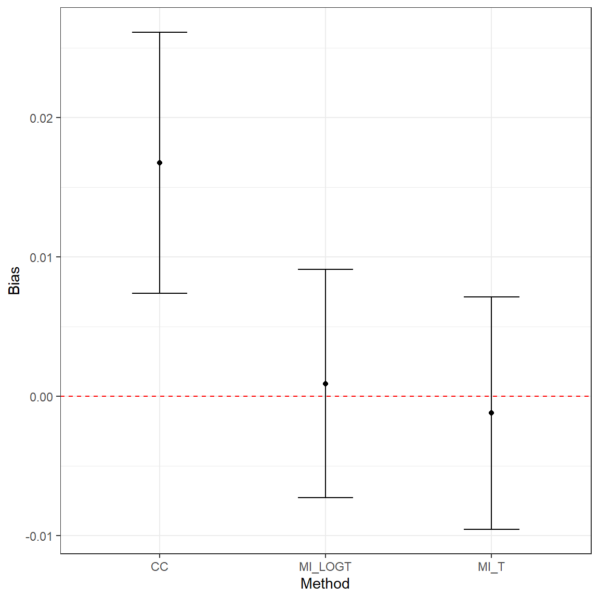
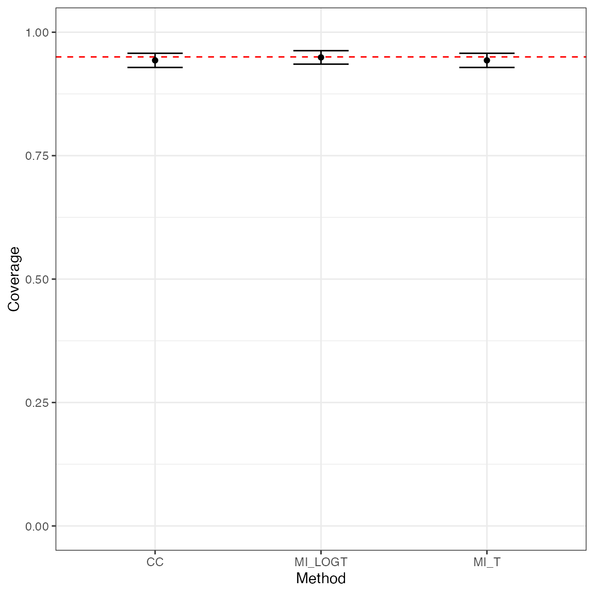
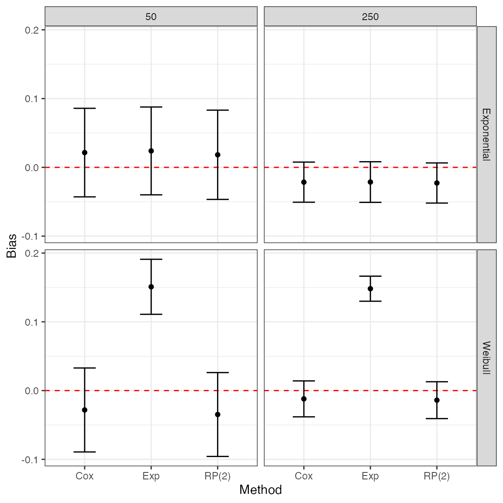

# Introduction to rsimsum

## rsimsum

`rsimsum` is an R package that can compute summary statistics from
simulation studies. It is inspired by the user-written command `simsum`
in Stata (White I.R., 2010).

The aim of `rsimsum` is helping reporting of simulation studies,
including understanding the role of chance in results of simulation
studies. Specifically, `rsimsum` can compute Monte Carlo standard errors
of summary statistics, defined as the standard deviation of the
estimated summary statistic; these are reported by default.

Formula for summary statistics and Monte Carlo standard errors are
presented in the next section. Note that the terms *summary statistic*
and *performance measure* are used interchangeably.

## Notation

We will use th following notation throughout this vignette:

- \theta: an estimand, and its true value
- n\_{\text{sim}}: number of simulations
- i = 1, \dots, n\_{\text{sim}}: indexes a given simulation
- \hat{\theta}\_i: the estimated value of \theta for the i^{\text{th}}
  replication
- \widehat{\text{Var}}(\hat{\theta}\_i): the estimated variance
  \text{Var}(\hat{\theta}\_i) of \hat{\theta}\_i for the i^{\text{th}}
  replication
- \text{Var}(\hat{\theta}): the empirical variance of \hat{\theta}
- \alpha: the nominal significance level

## Performance measures

The first performance measure of interest is **bias**, which quantifies
whether the estimator targets the true value \theta on average. Bias is
calculated as:

\text{Bias} = \frac{1}{n\_{\text{sim}}} \sum\_{i = 1} ^
{n\_{\text{sim}}} \hat{\theta}\_i - \theta

The Monte Carlo standard error of bias is calculated as:

\text{MCSE(Bias)} = \sqrt{\frac{\frac{1}{n\_{\text{sim}} - 1} \sum\_{i =
1} ^ {n\_{\text{sim}}} (\hat{\theta}\_i - \bar{\theta}) ^
2}{n\_{\text{sim}}}}

`rsimsum` can also compute **relative bias** (*relative* to the true
value \theta), which can be interpreted similarly as with bias, but in
relative terms rather than absolute. This is calculated as:

\text{Relative Bias} = \frac{1}{n\_{\text{sim}}} \sum\_{i = 1} ^
{n\_{\text{sim}}} \frac{\hat{\theta}\_i - \theta}{\theta}

Its Monte Carlo standard error is calculated as:

\text{MCSE(Relative Bias)} = \sqrt{\frac{1}{n\_{\text{sim}}
(n\_{\text{sim}} - 1)} \sum_i^{n\_{\text{sim}}} \left\[
\frac{\hat{\theta}\_i - \theta}{\theta} - \widehat{\text{Relative Bias}}
\right\]^2}

The **empirical standard error** of \theta depends only on \hat{\theta}
and does not require any knowledge of \theta. It estimates the standard
deviation of \hat{\theta} over the n\_{\text{sim}} replications:

\text{Empirical SE} = \sqrt{\frac{1}{n\_{\text{sim}} - 1} \sum\_{i = 1}
^ {n\_{\text{sim}}} (\hat{\theta}\_i - \bar{\theta}) ^ 2}

The Monte Carlo standard error is calculated as:

\text{MCSE(Emp. SE)} = \frac{\widehat{\text{Emp. SE}}}{\sqrt{2
(n\_{\text{sim}} - 1)}}

When comparing different methods, the **relative precision of a given
method B against a reference method A** is computed as:

\text{Relative \\ increase in precision} = 100 \left\[ \left(
\frac{\widehat{\text{Emp. SE}}\_A}{\widehat{\text{Emp. SE}}\_B} \right)
^ 2 - 1 \right\]

Its (approximated) Monte Carlo standard error is:

\text{MCSE(Relative \\ increase in precision)} \simeq 200 \left(
\frac{\widehat{\text{Emp. SE}}\_A}{\widehat{\text{Emp. SE}}\_B}
\right)^2 \sqrt{\frac{1 - \rho^2\_{AB}}{n\_{\text{sim}} - 1}}

\rho^2\_{AB} is the correlation of \hat{\theta}\_A and \hat{\theta}\_B.

A measure that takes into account both precision and accuracy of a
method is the **mean squared error**, which is the sum of the squared
bias and variance of \hat{\theta}:

\text{MSE} = \frac{1}{n\_{\text{sim}}} \sum\_{i = 1} ^ {n\_{\text{sim}}}
(\hat{\theta}\_i - \theta) ^ 2

The Monte Carlo standard error is:

\text{MCSE(MSE)} = \sqrt{\frac{\sum\_{i = 1} ^ {n\_{\text{sim}}} \left\[
(\hat{\theta}\_i - \theta) ^2 - \text{MSE} \right\] ^ 2}{n\_{\text{sim}}
(n\_{\text{sim}} - 1)}}

The **model based standard error** is computed by averaging the
estimated standard errors for each replication:

\text{Model SE} = \sqrt{\frac{1}{n\_{\text{sim}}} \sum\_{i = 1} ^
{n\_{\text{sim}}} \widehat{\text{Var}}(\hat{\theta}\_i)}

Its (approximated) Monte Carlo standard error is computed as:

\text{MCSE(Model SE)} \simeq
\sqrt{\frac{\text{Var}\[\widehat{\text{Var}}(\hat{\theta}\_i)\]}{4
n\_{\text{sim}} \widehat{\text{Model SE}}}}

The model standard error targets the empirical standard error. Hence,
the **relative error in the model standard error** is an informative
performance measure:

\text{Relative \\ error in model SE} = 100 \left( \frac{\text{Model
SE}}{\text{Empirical SE}} - 1\right)

Its Monte Carlo standard error is computed as:

\text{MCSE(Relative \\ error in model SE)} = 100 \left(
\frac{\text{Model SE}}{\text{Empirical SE}} \right)
\sqrt{\frac{\text{Var}\[\widehat{\text{Var}}(\hat{\theta}\_i)\]}{4
n\_{\text{sim}} \widehat{\text{Model SE}} ^ 4} +
\frac{1}{2(n\_{\text{sim}} - 1)}}

**Coverage** is another key property of an estimator. It is defined as
the probability that a confidence interval contains the true value
\theta, and computed as:

\text{Coverage} = \frac{1}{n\_{\text{sim}}} \sum\_{i = 1} ^
{n\_{\text{sim}}} I(\hat{\theta}\_{i, \text{low}} \le \theta \le
\hat{\theta}\_{i, \text{upp}})

where I(\cdot) is the indicator function. The Monte Carlo standard error
is computed as:

\text{MCSE(Coverage)} = \sqrt{\frac{\text{Coverage} \times (1 -
\text{Coverage})}{n\_{\text{sim}}}}

Under coverage is to be expected if:

1.  \text{Bias} \ne 0, or
2.  \text{Models SE} \< \text{Empirical SE}, or
3.  the distribution of \hat{\theta} is not normal and intervals have
    been constructed assuming normality, or
4.  \widehat{\text{Var}}(\hat{\theta}\_i) is too variable

Over coverage occurs as a result of \text{Models SE} \> \text{Empirical
SE}.

As under coverage may be a result of bias, another useful summary
statistic is **bias-eliminated coverage**:

\text{Bias-eliminated (BE) coverage} = \frac{1}{n\_{\text{sim}}}
\sum\_{i = 1} ^ {n\_{\text{sim}}} I(\hat{\theta}\_{i, \text{low}} \le
\bar{\theta} \le \hat{\theta}\_{i, \text{upp}})

The Monte Carlo standard error is analogously as coverage:

\text{MCSE(BE coverage)} = \sqrt{\frac{\text{BE coverage} \times (1 -
\text{BE coverage})}{n\_{\text{sim}}}}

Finally, **power** of a significance test at the \alpha level is defined
as:

\text{Power} = \frac{1}{n\_{\text{sim}}} \sum\_{i = 1} ^
{n\_{\text{sim}}} I \left\[ \|\hat{\theta}\_i\| \ge z\_{\alpha/2} \times
\sqrt{\widehat{\text{Var}}(\hat{\theta_i})} \right\]

The Monte Carlo standard error is analogously as coverage:

\text{MCSE(Power)} = \sqrt{\frac{\text{Power} \times (1 -
\text{Power})}{n\_{\text{sim}}}}

Further information on summary statistics for simulation studies can be
found in White (2010) and Morris, White, and Crowther (2019).

## Example 1: Simulation study on missing data

With this example dataset included in `rsimsum` we aim to summarise a
simulation study comparing different ways to handle missing covariates
when fitting a Cox model (White and Royston, 2009). One thousand
datasets were simulated, each containing normally distributed covariates
x and z and time-to-event outcome. Both covariates has 20\\ of their
values deleted independently of all other variables so the data became
missing completely at random (Little and Rubin, 2002). Each simulated
dataset was analysed in three ways. A Cox model was fit to the complete
cases (`CC`). Then two methods of multiple imputation using chained
equations (van Buuren, Boshuizen, and Knook, 1999) were used. The
`MI_LOGT` method multiply imputes the missing values of x and z with the
outcome included as \log(t) and d, where t is the survival time and d is
the event indicator. The `MI_T` method is the same except that \log(t)
is replaced by t in the imputation model.

We load the data in the usual way:

``` r

library(rsimsum)
data("MIsim", package = "rsimsum")
```

Let’s have a look at the first 10 rows of the dataset:

``` r

head(MIsim, n = 10)
#> # A tibble: 10 × 4
#>    dataset method      b    se
#>      <dbl> <chr>   <dbl> <dbl>
#>  1       1 CC      0.707 0.147
#>  2       1 MI_T    0.684 0.126
#>  3       1 MI_LOGT 0.712 0.141
#>  4       2 CC      0.349 0.160
#>  5       2 MI_T    0.406 0.141
#>  6       2 MI_LOGT 0.429 0.136
#>  7       3 CC      0.650 0.152
#>  8       3 MI_T    0.503 0.130
#>  9       3 MI_LOGT 0.560 0.117
#> 10       4 CC      0.432 0.126
```

The included variables are:

``` r

str(MIsim)
#> tibble [3,000 × 4] (S3: tbl_df/tbl/data.frame)
#>  $ dataset: num [1:3000] 1 1 1 2 2 2 3 3 3 4 ...
#>  $ method : chr [1:3000] "CC" "MI_T" "MI_LOGT" "CC" ...
#>  $ b      : num [1:3000] 0.707 0.684 0.712 0.349 0.406 ...
#>  $ se     : num [1:3000] 0.147 0.126 0.141 0.16 0.141 ...
#>  - attr(*, "label")= chr "simsum example: data from a simulation study comparing 3 ways to handle missing"
```

- `dataset`, the number of the simulated dataset;

- `method`, the method used (`CC`, `MI_LOGT` or `MI_T`);

- `b`, the point estimate;

- `se`, the standard error of the point estimate.

We summarise the results of the simulation study by method using the
`simsum` function:

``` r

s1 <- simsum(data = MIsim, estvarname = "b", true = 0.50, se = "se", methodvar = "method", ref = "CC")
```

We set `true = 0.50` as the true value of the point estimate `b` - under
which the data was simulated - is 0.50. We select `CC` as the reference
method as we consider the complete cases analysis the reference method
to benchmark against; if we do not set a reference method, `simsum`
picks one automatically.

Using the default settings, Monte Carlo standard errors are computed and
returned.

Summarising a `simsum` object, we obtain the following output:

``` r

ss1 <- summary(s1)
ss1
#> Values are:
#>  Point Estimate (Monte Carlo Standard Error)
#> 
#> Non-missing point estimates/standard errors:
#>    CC MI_LOGT MI_T
#>  1000    1000 1000
#> 
#> Average point estimate:
#>      CC MI_LOGT   MI_T
#>  0.5168  0.5009 0.4988
#> 
#> Median point estimate:
#>      CC MI_LOGT   MI_T
#>  0.5070  0.4969 0.4939
#> 
#> Average variance:
#>      CC MI_LOGT   MI_T
#>  0.0216  0.0182 0.0179
#> 
#> Median variance:
#>      CC MI_LOGT   MI_T
#>  0.0211  0.0172 0.0169
#> 
#> Bias in point estimate:
#>               CC         MI_LOGT             MI_T
#>  0.0168 (0.0048) 0.0009 (0.0042) -0.0012 (0.0043)
#> 
#> Relative bias in point estimate:
#>               CC         MI_LOGT             MI_T
#>  0.0335 (0.0096) 0.0018 (0.0083) -0.0024 (0.0085)
#> 
#> Empirical standard error:
#>               CC         MI_LOGT            MI_T
#>  0.1511 (0.0034) 0.1320 (0.0030) 0.1344 (0.0030)
#> 
#> % gain in precision relative to method CC:
#>               CC          MI_LOGT             MI_T
#>  0.0000 (0.0000) 31.0463 (3.9375) 26.3682 (3.8424)
#> 
#> Mean squared error:
#>               CC         MI_LOGT            MI_T
#>  0.0231 (0.0011) 0.0174 (0.0009) 0.0181 (0.0009)
#> 
#> Model-based standard error:
#>               CC         MI_LOGT            MI_T
#>  0.1471 (0.0005) 0.1349 (0.0006) 0.1338 (0.0006)
#> 
#> Relative % error in standard error:
#>                CC         MI_LOGT             MI_T
#>  -2.6594 (2.2055) 2.2233 (2.3323) -0.4412 (2.2695)
#> 
#> Coverage of nominal 95% confidence interval:
#>               CC         MI_LOGT            MI_T
#>  0.9430 (0.0073) 0.9490 (0.0070) 0.9430 (0.0073)
#> 
#> Bias-eliminated coverage of nominal 95% confidence interval:
#>               CC         MI_LOGT            MI_T
#>  0.9400 (0.0075) 0.9490 (0.0070) 0.9430 (0.0073)
#> 
#> Power of 5% level test:
#>               CC         MI_LOGT            MI_T
#>  0.9460 (0.0071) 0.9690 (0.0055) 0.9630 (0.0060)
```

The output begins with a brief overview of the setting of the simulation
study (e.g. the method variable, unique methods, etc.), and continues
with each summary statistic by method (if defined, as in this case). The
values that are reported are point estimates with Monte Carlo standard
errors in brackets; however, it is also possible to require confidence
intervals based on Monte Carlo standard errors to be reported instead:

``` r

print(ss1, mcse = FALSE)
#> Values are:
#>  Point Estimate (95% Confidence Interval based on Monte Carlo Standard Errors)
#> 
#> Non-missing point estimates/standard errors:
#>    CC MI_LOGT MI_T
#>  1000    1000 1000
#> 
#> Average point estimate:
#>      CC MI_LOGT   MI_T
#>  0.5168  0.5009 0.4988
#> 
#> Median point estimate:
#>      CC MI_LOGT   MI_T
#>  0.5070  0.4969 0.4939
#> 
#> Average variance:
#>      CC MI_LOGT   MI_T
#>  0.0216  0.0182 0.0179
#> 
#> Median variance:
#>      CC MI_LOGT   MI_T
#>  0.0211  0.0172 0.0169
#> 
#> Bias in point estimate:
#>                       CC                  MI_LOGT                      MI_T
#>  0.0168 (0.0074, 0.0261) 0.0009 (-0.0073, 0.0091) -0.0012 (-0.0095, 0.0071)
#> 
#> Relative bias in point estimate:
#>                       CC                  MI_LOGT                      MI_T
#>  0.0335 (0.0148, 0.0523) 0.0018 (-0.0145, 0.0182) -0.0024 (-0.0190, 0.0143)
#> 
#> Empirical standard error:
#>                       CC                 MI_LOGT                    MI_T
#>  0.1511 (0.1445, 0.1577) 0.1320 (0.1262, 0.1378) 0.1344 (0.1285, 0.1403)
#> 
#> % gain in precision relative to method CC:
#>                        CC                    MI_LOGT                       MI_T
#>  0.0000 (-0.0000, 0.0000) 31.0463 (23.3290, 38.7636) 26.3682 (18.8372, 33.8991)
#> 
#> Mean squared error:
#>                       CC                 MI_LOGT                    MI_T
#>  0.0231 (0.0209, 0.0253) 0.0174 (0.0157, 0.0191) 0.0181 (0.0163, 0.0198)
#> 
#> Model-based standard error:
#>                       CC                 MI_LOGT                    MI_T
#>  0.1471 (0.1461, 0.1481) 0.1349 (0.1338, 0.1361) 0.1338 (0.1327, 0.1350)
#> 
#> Relative % error in standard error:
#>                         CC                  MI_LOGT                      MI_T
#>  -2.6594 (-6.9820, 1.6633) 2.2233 (-2.3480, 6.7946) -0.4412 (-4.8894, 4.0070)
#> 
#> Coverage of nominal 95% confidence interval:
#>                       CC                 MI_LOGT                    MI_T
#>  0.9430 (0.9286, 0.9574) 0.9490 (0.9354, 0.9626) 0.9430 (0.9286, 0.9574)
#> 
#> Bias-eliminated coverage of nominal 95% confidence interval:
#>                       CC                 MI_LOGT                    MI_T
#>  0.9400 (0.9253, 0.9547) 0.9490 (0.9354, 0.9626) 0.9430 (0.9286, 0.9574)
#> 
#> Power of 5% level test:
#>                       CC                 MI_LOGT                    MI_T
#>  0.9460 (0.9320, 0.9600) 0.9690 (0.9583, 0.9797) 0.9630 (0.9513, 0.9747)
```

Highlighting some points of interest from the summary results above:

1.  The `CC` method has small-sample bias away from the null (point
    estimate 0.0168, with 95% confidence interval: 0.0074 - 0.0261);
2.  `CC` is inefficient compared with `MI_LOGT` and `MI_T`: the relative
    gain in precision for these two methods is 1.3105% and 1.2637%
    compared to `CC`, respectively;
3.  Model-based standard errors are close to empirical standard errors;
4.  Coverage of nominal 95% confidence intervals also seems fine, which
    is not surprising in view of the generally low (or lack of) bias and
    good model-based standard errors;
5.  `CC` has lower power compared with `MI_LOGT` and `MI_T`, which is
    not surprising in view of its inefficiency.

### Tabulating summary statistics

It is straightforward to produce a table of summary statistics for use
in an R Markdown document:

``` r

library(knitr)
#> 
#> Attaching package: 'knitr'
#> The following object is masked from 'package:rsimsum':
#> 
#>     kable
kable(tidy(ss1))
```

| stat        |          est |      mcse | method  |      lower |      upper |
|:------------|-------------:|----------:|:--------|-----------:|-----------:|
| nsim        | 1000.0000000 |        NA | CC      |         NA |         NA |
| thetamean   |    0.5167662 |        NA | CC      |         NA |         NA |
| thetamedian |    0.5069935 |        NA | CC      |         NA |         NA |
| se2mean     |    0.0216373 |        NA | CC      |         NA |         NA |
| se2median   |    0.0211425 |        NA | CC      |         NA |         NA |
| bias        |    0.0167662 | 0.0047787 | CC      |  0.0074001 |  0.0261322 |
| rbias       |    0.0335323 | 0.0095574 | CC      |  0.0148003 |  0.0522644 |
| empse       |    0.1511150 | 0.0033807 | CC      |  0.1444889 |  0.1577411 |
| mse         |    0.0230940 | 0.0011338 | CC      |  0.0208717 |  0.0253163 |
| relprec     |    0.0000000 | 0.0000001 | CC      | -0.0000002 |  0.0000002 |
| modelse     |    0.1470963 | 0.0005274 | CC      |  0.1460626 |  0.1481300 |
| relerror    |   -2.6593842 | 2.2054817 | CC      | -6.9820490 |  1.6632806 |
| cover       |    0.9430000 | 0.0073315 | CC      |  0.9286305 |  0.9573695 |
| becover     |    0.9400000 | 0.0075100 | CC      |  0.9252807 |  0.9547193 |
| power       |    0.9460000 | 0.0071473 | CC      |  0.9319915 |  0.9600085 |
| nsim        | 1000.0000000 |        NA | MI_LOGT |         NA |         NA |
| thetamean   |    0.5009231 |        NA | MI_LOGT |         NA |         NA |
| thetamedian |    0.4969223 |        NA | MI_LOGT |         NA |         NA |
| se2mean     |    0.0182091 |        NA | MI_LOGT |         NA |         NA |
| se2median   |    0.0172157 |        NA | MI_LOGT |         NA |         NA |
| bias        |    0.0009231 | 0.0041744 | MI_LOGT | -0.0072586 |  0.0091048 |
| rbias       |    0.0018462 | 0.0083488 | MI_LOGT | -0.0145172 |  0.0182096 |
| empse       |    0.1320064 | 0.0029532 | MI_LOGT |  0.1262182 |  0.1377947 |
| mse         |    0.0174091 | 0.0008813 | MI_LOGT |  0.0156818 |  0.0191364 |
| relprec     |   31.0463410 | 3.9374726 | MI_LOGT | 23.3290364 | 38.7636456 |
| modelse     |    0.1349413 | 0.0006046 | MI_LOGT |  0.1337563 |  0.1361263 |
| relerror    |    2.2232593 | 2.3323382 | MI_LOGT | -2.3480396 |  6.7945582 |
| cover       |    0.9490000 | 0.0069569 | MI_LOGT |  0.9353647 |  0.9626353 |
| becover     |    0.9490000 | 0.0069569 | MI_LOGT |  0.9353647 |  0.9626353 |
| power       |    0.9690000 | 0.0054808 | MI_LOGT |  0.9582579 |  0.9797421 |
| nsim        | 1000.0000000 |        NA | MI_T    |         NA |         NA |
| thetamean   |    0.4988092 |        NA | MI_T    |         NA |         NA |
| thetamedian |    0.4939111 |        NA | MI_T    |         NA |         NA |
| se2mean     |    0.0179117 |        NA | MI_T    |         NA |         NA |
| se2median   |    0.0169319 |        NA | MI_T    |         NA |         NA |
| bias        |   -0.0011908 | 0.0042510 | MI_T    | -0.0095226 |  0.0071409 |
| rbias       |   -0.0023817 | 0.0085020 | MI_T    | -0.0190452 |  0.0142819 |
| empse       |    0.1344277 | 0.0030074 | MI_T    |  0.1285333 |  0.1403221 |
| mse         |    0.0180542 | 0.0009112 | MI_T    |  0.0162682 |  0.0198401 |
| relprec     |   26.3681613 | 3.8423791 | MI_T    | 18.8372366 | 33.8990859 |
| modelse     |    0.1338346 | 0.0005856 | MI_T    |  0.1326867 |  0.1349824 |
| relerror    |   -0.4412233 | 2.2695216 | MI_T    | -4.8894038 |  4.0069573 |
| cover       |    0.9430000 | 0.0073315 | MI_T    |  0.9286305 |  0.9573695 |
| becover     |    0.9430000 | 0.0073315 | MI_T    |  0.9286305 |  0.9573695 |
| power       |    0.9630000 | 0.0059692 | MI_T    |  0.9513006 |  0.9746994 |

Using [`tidy()`](https://generics.r-lib.org/reference/tidy.html) in
combination with R packages such as
[xtable](https://cran.r-project.org/package=xtable),
[kableExtra](https://cran.r-project.org/package=kableExtra),
[tables](https://cran.r-project.org/package=tables) can yield a variety
of tables that should suit most purposes.

More information on producing tables directly from R can be found in the
[CRAN Task View on Reproducible
Research](https://CRAN.R-project.org/view=ReproducibleResearch).

### Plotting summary statistics

In this section, we show how to plot and compare summary statistics
using the popular R package
[ggplot](https://CRAN.R-project.org/package=ggplot2).

Plotting bias by method with 95\\ confidence intervals based on Monte
Carlo standard errors:

``` r

library(ggplot2)
ggplot(tidy(ss1, stats = "bias"), aes(x = method, y = est, ymin = lower, ymax = upper)) +
  geom_hline(yintercept = 0, color = "red", lty = "dashed") +
  geom_point() +
  geom_errorbar(width = 1 / 3) +
  theme_bw() +
  labs(x = "Method", y = "Bias")
```



Conversely, say we want to visually compare coverage for the three
methods compared with this simulation study:

``` r

ggplot(tidy(ss1, stats = "cover"), aes(x = method, y = est, ymin = lower, ymax = upper)) +
  geom_hline(yintercept = 0.95, color = "red", lty = "dashed") +
  geom_point() +
  geom_errorbar(width = 1 / 3) +
  coord_cartesian(ylim = c(0, 1)) +
  theme_bw() +
  labs(x = "Method", y = "Coverage")
```



### Dropping large estimates and standard errors

`rsimsum` allows to automatically drop estimates and standard errors
that are larger than a predefined value. Specifically, the argument of
`simsum` that control this behaviour is `dropbig`, with tuning
parameters `dropbig.max` and `dropbig.semax` that can be passed via the
`control` argument.

Set `dropbig` to `TRUE` and standardised estimates larger than `max` in
absolute value will be dropped; standard errors larger than `semax`
times the average standard error will be dropped too. By default, robust
standardisation is used (based on median and inter-quartile range);
however, it is also possible to request regular standardisation (based
on mean and standard deviation) by setting the control parameter
`dropbig.robust = FALSE`.

For instance, say we want to drop standardised estimates larger than 3
in absolute value and standard errors larger than 1.5 times the average
standard error:

``` r

s1.2 <- simsum(data = MIsim, estvarname = "b", true = 0.50, se = "se", methodvar = "method", ref = "CC", dropbig = TRUE, control = list(dropbig.max = 4, dropbig.semax = 1.5))
```

Some estimates were dropped, as we can see from the number of
non-missing point estimates, standard errors:

``` r

summary(s1.2, stats = "nsim")
#> Values are:
#>  Point Estimate (Monte Carlo Standard Error)
#> 
#> Non-missing point estimates/standard errors:
#>   CC MI_LOGT MI_T
#>  958     951  944
```

Everything else works analogously as before; for instance, to summarise
the results:

``` r

summary(s1.2)
#> Values are:
#>  Point Estimate (Monte Carlo Standard Error)
#> 
#> Non-missing point estimates/standard errors:
#>   CC MI_LOGT MI_T
#>  958     951  944
#> 
#> Average point estimate:
#>      CC MI_LOGT   MI_T
#>  0.5142  0.4978 0.4973
#> 
#> Median point estimate:
#>      CC MI_LOGT   MI_T
#>  0.5065  0.4934 0.4939
#> 
#> Average variance:
#>      CC MI_LOGT   MI_T
#>  0.0213  0.0175 0.0173
#> 
#> Median variance:
#>      CC MI_LOGT   MI_T
#>  0.0211  0.0170 0.0167
#> 
#> Bias in point estimate:
#>               CC          MI_LOGT             MI_T
#>  0.0142 (0.0048) -0.0022 (0.0043) -0.0027 (0.0043)
#> 
#> Relative bias in point estimate:
#>               CC          MI_LOGT             MI_T
#>  0.0283 (0.0096) -0.0044 (0.0086) -0.0055 (0.0086)
#> 
#> Empirical standard error:
#>               CC         MI_LOGT            MI_T
#>  0.1493 (0.0034) 0.1320 (0.0030) 0.1323 (0.0030)
#> 
#> % gain in precision relative to method CC:
#>               CC          MI_LOGT             MI_T
#>  0.0000 (0.0000) 27.9890 (3.9442) 27.4611 (4.0317)
#> 
#> Mean squared error:
#>               CC         MI_LOGT            MI_T
#>  0.0225 (0.0011) 0.0174 (0.0009) 0.0175 (0.0009)
#> 
#> Model-based standard error:
#>               CC         MI_LOGT            MI_T
#>  0.1459 (0.0005) 0.1323 (0.0005) 0.1314 (0.0005)
#> 
#> Relative % error in standard error:
#>                CC         MI_LOGT             MI_T
#>  -2.2821 (2.2545) 0.2271 (2.3291) -0.6949 (2.3128)
#> 
#> Coverage of nominal 95% confidence interval:
#>               CC         MI_LOGT            MI_T
#>  0.9447 (0.0074) 0.9464 (0.0073) 0.9417 (0.0076)
#> 
#> Bias-eliminated coverage of nominal 95% confidence interval:
#>               CC         MI_LOGT            MI_T
#>  0.9426 (0.0075) 0.9453 (0.0074) 0.9439 (0.0075)
#> 
#> Power of 5% level test:
#>               CC         MI_LOGT            MI_T
#>  0.9457 (0.0073) 0.9685 (0.0057) 0.9661 (0.0059)
```

## Example 2: Simulation study on survival modelling

``` r

data("relhaz", package = "rsimsum")
```

Let’s have a look at the first 10 rows of the dataset:

``` r

head(relhaz, n = 10)
#>    dataset  n    baseline       theta        se model
#> 1        1 50 Exponential -0.88006151 0.3330172   Cox
#> 2        2 50 Exponential -0.81460242 0.3253010   Cox
#> 3        3 50 Exponential -0.14262887 0.3050516   Cox
#> 4        4 50 Exponential -0.33251820 0.3144033   Cox
#> 5        5 50 Exponential -0.48269940 0.3064726   Cox
#> 6        6 50 Exponential -0.03160756 0.3097203   Cox
#> 7        7 50 Exponential -0.23578090 0.3121350   Cox
#> 8        8 50 Exponential -0.05046332 0.3136058   Cox
#> 9        9 50 Exponential -0.22378715 0.3066037   Cox
#> 10      10 50 Exponential -0.45326446 0.3330173   Cox
```

The included variables are:

``` r

str(relhaz)
#> 'data.frame':    1200 obs. of  6 variables:
#>  $ dataset : int  1 2 3 4 5 6 7 8 9 10 ...
#>  $ n       : num  50 50 50 50 50 50 50 50 50 50 ...
#>  $ baseline: chr  "Exponential" "Exponential" "Exponential" "Exponential" ...
#>  $ theta   : num  -0.88 -0.815 -0.143 -0.333 -0.483 ...
#>  $ se      : num  0.333 0.325 0.305 0.314 0.306 ...
#>  $ model   : chr  "Cox" "Cox" "Cox" "Cox" ...
```

- `dataset`, simulated dataset number;

- `n`, sample size of the simulate dataset;

- `baseline`, baseline hazard function of the simulated dataset;

- `model`, method used (Cox model or Royston-Parmar model with 2 degrees
  of freedom);

- `theta`, point estimate for the log-hazard ratio;

- `se`, standard error of the point estimate.

`rsimsum` can summarise results from simulation studies with several
data-generating mechanisms. For instance, with this example we show how
to compute summary statistics by baseline hazard function and sample
size.

In order to summarise results by data-generating factors, it is
sufficient to define the “by” factors in the call to `simsum`:

``` r

s2 <- simsum(data = relhaz, estvarname = "theta", true = -0.50, se = "se", methodvar = "model", by = c("baseline", "n"))
#> 'ref' method was not specified, Cox set as the reference
s2
#> Summary of a simulation study with a single estimand.
#> True value of the estimand: -0.5 
#> 
#> Method variable: model 
#>  Unique methods: Cox, Exp, RP(2) 
#>  Reference method: Cox 
#> 
#> By factors: baseline, n 
#> 
#> Monte Carlo standard errors were computed.
```

The difference between `methodvar` and `by` is as follows: `methodvar`
represents methods (e.g. the two models, in this example) compared with
this simulation study, while `by` represents all possible
data-generating factors that varied when simulating data (in this case,
sample size and the true baseline hazard function).

Summarising the results will be printed out for each method and
combination of data-generating factors:

``` r

ss2 <- summary(s2)
ss2
#> Values are:
#>  Point Estimate (Monte Carlo Standard Error)
#> 
#> Non-missing point estimates/standard errors:
#>     baseline   n Cox Exp RP(2)
#>  Exponential  50 100 100   100
#>  Exponential 250 100 100   100
#>      Weibull  50 100 100   100
#>      Weibull 250 100 100   100
#> 
#> Average point estimate:
#>     baseline   n     Cox     Exp   RP(2)
#>  Exponential  50 -0.4785 -0.4761 -0.4817
#>  Exponential 250 -0.5215 -0.5214 -0.5227
#>      Weibull  50 -0.5282 -0.3491 -0.5348
#>      Weibull 250 -0.5120 -0.3518 -0.5139
#> 
#> Median point estimate:
#>     baseline   n     Cox     Exp   RP(2)
#>  Exponential  50 -0.4507 -0.4571 -0.4574
#>  Exponential 250 -0.5184 -0.5165 -0.5209
#>      Weibull  50 -0.5518 -0.3615 -0.5425
#>      Weibull 250 -0.5145 -0.3633 -0.5078
#> 
#> Average variance:
#>     baseline   n    Cox    Exp  RP(2)
#>  Exponential  50 0.1014 0.0978 0.1002
#>  Exponential 250 0.0195 0.0191 0.0194
#>      Weibull  50 0.0931 0.0834 0.0898
#>      Weibull 250 0.0174 0.0164 0.0172
#> 
#> Median variance:
#>     baseline   n    Cox    Exp  RP(2)
#>  Exponential  50 0.1000 0.0972 0.0989
#>  Exponential 250 0.0195 0.0190 0.0194
#>      Weibull  50 0.0914 0.0825 0.0875
#>      Weibull 250 0.0174 0.0164 0.0171
#> 
#> Bias in point estimate:
#>     baseline   n              Cox              Exp            RP(2)
#>  Exponential  50  0.0215 (0.0328)  0.0239 (0.0326)  0.0183 (0.0331)
#>  Exponential 250 -0.0215 (0.0149) -0.0214 (0.0151) -0.0227 (0.0149)
#>      Weibull  50 -0.0282 (0.0311)  0.1509 (0.0204) -0.0348 (0.0311)
#>      Weibull 250 -0.0120 (0.0133)  0.1482 (0.0093) -0.0139 (0.0137)
#> 
#> Relative bias in point estimate:
#>     baseline   n              Cox              Exp            RP(2)
#>  Exponential  50 -0.0430 (0.0657) -0.0478 (0.0652) -0.0366 (0.0662)
#>  Exponential 250  0.0430 (0.0298)  0.0427 (0.0301)  0.0455 (0.0298)
#>      Weibull  50  0.0564 (0.0623) -0.3018 (0.0408)  0.0695 (0.0622)
#>      Weibull 250  0.0241 (0.0267) -0.2963 (0.0186)  0.0279 (0.0274)
#> 
#> Empirical standard error:
#>     baseline   n             Cox             Exp           RP(2)
#>  Exponential  50 0.3285 (0.0233) 0.3258 (0.0232) 0.3312 (0.0235)
#>  Exponential 250 0.1488 (0.0106) 0.1506 (0.0107) 0.1489 (0.0106)
#>      Weibull  50 0.3115 (0.0221) 0.2041 (0.0145) 0.3111 (0.0221)
#>      Weibull 250 0.1333 (0.0095) 0.0929 (0.0066) 0.1368 (0.0097)
#> 
#> % gain in precision relative to method Cox:
#>     baseline   n             Cox                Exp            RP(2)
#>  Exponential  50 0.0000 (0.0000)    1.6773 (3.2902) -1.6228 (1.7887)
#>  Exponential 250 0.0000 (0.0000)   -2.3839 (3.0501) -0.1491 (0.9916)
#>      Weibull  50 0.0000 (0.0000) 132.7958 (16.4433)  0.2412 (3.7361)
#>      Weibull 250 0.0000 (0.0000) 105.8426 (12.4932) -4.9519 (2.0647)
#> 
#> Mean squared error:
#>     baseline   n             Cox             Exp           RP(2)
#>  Exponential  50 0.1073 (0.0149) 0.1056 (0.0146) 0.1089 (0.0154)
#>  Exponential 250 0.0224 (0.0028) 0.0229 (0.0028) 0.0225 (0.0028)
#>      Weibull  50 0.0968 (0.0117) 0.0640 (0.0083) 0.0970 (0.0117)
#>      Weibull 250 0.0177 (0.0027) 0.0305 (0.0033) 0.0187 (0.0028)
#> 
#> Model-based standard error:
#>     baseline   n             Cox             Exp           RP(2)
#>  Exponential  50 0.3185 (0.0013) 0.3127 (0.0010) 0.3165 (0.0012)
#>  Exponential 250 0.1396 (0.0002) 0.1381 (0.0002) 0.1394 (0.0002)
#>      Weibull  50 0.3052 (0.0014) 0.2888 (0.0005) 0.2996 (0.0012)
#>      Weibull 250 0.1320 (0.0002) 0.1281 (0.0001) 0.1313 (0.0002)
#> 
#> Relative % error in standard error:
#>     baseline   n              Cox               Exp            RP(2)
#>  Exponential  50 -3.0493 (6.9011)  -4.0156 (6.8286) -4.4305 (6.8013)
#>  Exponential 250 -6.2002 (6.6679)  -8.3339 (6.5160) -6.4133 (6.6528)
#>      Weibull  50 -2.0115 (6.9776) 41.4993 (10.0594) -3.6873 (6.8549)
#>      Weibull 250 -0.9728 (7.0397)  37.7762 (9.7917) -4.0191 (6.8228)
#> 
#> Coverage of nominal 95% confidence interval:
#>     baseline   n             Cox             Exp           RP(2)
#>  Exponential  50 0.9500 (0.0218) 0.9400 (0.0237) 0.9500 (0.0218)
#>  Exponential 250 0.9300 (0.0255) 0.9200 (0.0271) 0.9300 (0.0255)
#>      Weibull  50 0.9700 (0.0171) 0.9900 (0.0099) 0.9500 (0.0218)
#>      Weibull 250 0.9400 (0.0237) 0.8500 (0.0357) 0.9400 (0.0237)
#> 
#> Bias-eliminated coverage of nominal 95% confidence interval:
#>     baseline   n             Cox             Exp           RP(2)
#>  Exponential  50 0.9500 (0.0218) 0.9500 (0.0218) 0.9500 (0.0218)
#>  Exponential 250 0.9400 (0.0237) 0.9400 (0.0237) 0.9400 (0.0237)
#>      Weibull  50 0.9500 (0.0218) 1.0000 (0.0000) 0.9500 (0.0218)
#>      Weibull 250 0.9500 (0.0218) 0.9900 (0.0099) 0.9400 (0.0237)
#> 
#> Power of 5% level test:
#>     baseline   n             Cox             Exp           RP(2)
#>  Exponential  50 0.3600 (0.0480) 0.3800 (0.0485) 0.3700 (0.0483)
#>  Exponential 250 0.9800 (0.0140) 0.9900 (0.0099) 0.9900 (0.0099)
#>      Weibull  50 0.4300 (0.0495) 0.0900 (0.0286) 0.4700 (0.0499)
#>      Weibull 250 0.9700 (0.0171) 0.8600 (0.0347) 0.9700 (0.0171)
```

### Plotting summary statistics

Tables could get cumbersome when there are many different
data-generating mechanisms. Plots are generally easier to interpret, and
can be generated as easily as before.

Say we want to compare bias for each method by baseline hazard function
and sample size using faceting:

``` r

ggplot(tidy(ss2, stats = "bias"), aes(x = model, y = est, ymin = lower, ymax = upper)) +
  geom_hline(yintercept = 0, color = "red", lty = "dashed") +
  geom_point() +
  geom_errorbar(width = 1 / 3) +
  facet_grid(baseline ~ n) +
  theme_bw() +
  labs(x = "Method", y = "Bias")
```



## References

- White, I.R. 2010. *simsum: Analyses of simulation studies including
  Monte Carlo error*. The Stata Journal 10(3): 369-385
- Morris, T.P., White, I.R. and Crowther, M.J. 2019. *Using simulation
  studies to evaluate statistical methods*. Statistics in Medicine
  38:2074-2102
- White, I.R., and P. Royston. 2009. *Imputing missing covariate values
  for the Cox model*. Statistics in Medicine 28(15):1982-1998
- Little, R.J.A., and D.B. Rubin. 2002. *Statistical analysis with
  missing data*. 2nd ed. Hoboken, NJ: Wiley
- van Buuren, S., H.C. Boshuizen, and D.L. Knook. 1999. *Multiple
  imputation of missing blood pressure covariates in survival analysis*.
  Statistics in Medicine 18(6):681-694
