# Visualising results from rsimsum

This vignette requires the following R packages:

``` r

library(rsimsum)
library(ggplot2)
```

## Data

We use data from a simulation study on misspecification of the baseline
hazard in survival models. This dataset is included in `rsimsum` and can
be loaded with:

``` r

data("relhaz", package = "rsimsum")
```

Inspecting the structure of the dataset and the first 15 rows of data:

``` r

str(relhaz)
#> 'data.frame':    1200 obs. of  6 variables:
#>  $ dataset : int  1 2 3 4 5 6 7 8 9 10 ...
#>  $ n       : num  50 50 50 50 50 50 50 50 50 50 ...
#>  $ baseline: chr  "Exponential" "Exponential" "Exponential" "Exponential" ...
#>  $ theta   : num  -0.88 -0.815 -0.143 -0.333 -0.483 ...
#>  $ se      : num  0.333 0.325 0.305 0.314 0.306 ...
#>  $ model   : chr  "Cox" "Cox" "Cox" "Cox" ...
head(relhaz, n = 15)
#>    dataset  n    baseline       theta        se model
#> 1        1 50 Exponential -0.88006151 0.3330172   Cox
#> 2        2 50 Exponential -0.81460242 0.3253010   Cox
#> 3        3 50 Exponential -0.14262887 0.3050516   Cox
#> 4        4 50 Exponential -0.33251820 0.3144033   Cox
#> 5        5 50 Exponential -0.48269940 0.3064726   Cox
#> 6        6 50 Exponential -0.03160756 0.3097203   Cox
#> 7        7 50 Exponential -0.23578090 0.3121350   Cox
#> 8        8 50 Exponential -0.05046332 0.3136058   Cox
#> 9        9 50 Exponential -0.22378715 0.3066037   Cox
#> 10      10 50 Exponential -0.45326446 0.3330173   Cox
#> 11      11 50 Exponential -0.71402510 0.3251902   Cox
#> 12      12 50 Exponential -0.32956944 0.3073481   Cox
#> 13      13 50 Exponential -0.15351788 0.3056453   Cox
#> 14      14 50 Exponential -0.82742207 0.3283561   Cox
#> 15      15 50 Exponential -0.14594648 0.3255636   Cox
```

## Summarise results

We use the `simsum` function to summarise results:

``` r

s1 <- simsum(
  data = relhaz, estvarname = "theta", se = "se", true = -0.50,
  methodvar = "model", by = c("n", "baseline"), x = TRUE
)
#> 'ref' method was not specified, Cox set as the reference
s1
#> Summary of a simulation study with a single estimand.
#> True value of the estimand: -0.5 
#> 
#> Method variable: model 
#>  Unique methods: Cox, Exp, RP(2) 
#>  Reference method: Cox 
#> 
#> By factors: n, baseline 
#> 
#> Monte Carlo standard errors were computed.
```

We call `simsum` with `x = TRUE` as that is required for some types of
plots (e.g. zip plots, scatter plots, etc.).

``` r

summary(s1)
#> Values are:
#>  Point Estimate (Monte Carlo Standard Error)
#> 
#> Non-missing point estimates/standard errors:
#>    n    baseline Cox Exp RP(2)
#>   50 Exponential 100 100   100
#>   50     Weibull 100 100   100
#>  250 Exponential 100 100   100
#>  250     Weibull 100 100   100
#> 
#> Average point estimate:
#>    n    baseline     Cox     Exp   RP(2)
#>   50 Exponential -0.4785 -0.4761 -0.4817
#>   50     Weibull -0.5282 -0.3491 -0.5348
#>  250 Exponential -0.5215 -0.5214 -0.5227
#>  250     Weibull -0.5120 -0.3518 -0.5139
#> 
#> Median point estimate:
#>    n    baseline     Cox     Exp   RP(2)
#>   50 Exponential -0.4507 -0.4571 -0.4574
#>   50     Weibull -0.5518 -0.3615 -0.5425
#>  250 Exponential -0.5184 -0.5165 -0.5209
#>  250     Weibull -0.5145 -0.3633 -0.5078
#> 
#> Average variance:
#>    n    baseline    Cox    Exp  RP(2)
#>   50 Exponential 0.1014 0.0978 0.1002
#>   50     Weibull 0.0931 0.0834 0.0898
#>  250 Exponential 0.0195 0.0191 0.0194
#>  250     Weibull 0.0174 0.0164 0.0172
#> 
#> Median variance:
#>    n    baseline    Cox    Exp  RP(2)
#>   50 Exponential 0.1000 0.0972 0.0989
#>   50     Weibull 0.0914 0.0825 0.0875
#>  250 Exponential 0.0195 0.0190 0.0194
#>  250     Weibull 0.0174 0.0164 0.0171
#> 
#> Bias in point estimate:
#>    n    baseline              Cox              Exp            RP(2)
#>   50 Exponential  0.0215 (0.0328)  0.0239 (0.0326)  0.0183 (0.0331)
#>   50     Weibull -0.0282 (0.0311)  0.1509 (0.0204) -0.0348 (0.0311)
#>  250 Exponential -0.0215 (0.0149) -0.0214 (0.0151) -0.0227 (0.0149)
#>  250     Weibull -0.0120 (0.0133)  0.1482 (0.0093) -0.0139 (0.0137)
#> 
#> Relative bias in point estimate:
#>    n    baseline              Cox              Exp            RP(2)
#>   50 Exponential -0.0430 (0.0657) -0.0478 (0.0652) -0.0366 (0.0662)
#>   50     Weibull  0.0564 (0.0623) -0.3018 (0.0408)  0.0695 (0.0622)
#>  250 Exponential  0.0430 (0.0298)  0.0427 (0.0301)  0.0455 (0.0298)
#>  250     Weibull  0.0241 (0.0267) -0.2963 (0.0186)  0.0279 (0.0274)
#> 
#> Empirical standard error:
#>    n    baseline             Cox             Exp           RP(2)
#>   50 Exponential 0.3285 (0.0233) 0.3258 (0.0232) 0.3312 (0.0235)
#>   50     Weibull 0.3115 (0.0221) 0.2041 (0.0145) 0.3111 (0.0221)
#>  250 Exponential 0.1488 (0.0106) 0.1506 (0.0107) 0.1489 (0.0106)
#>  250     Weibull 0.1333 (0.0095) 0.0929 (0.0066) 0.1368 (0.0097)
#> 
#> % gain in precision relative to method Cox:
#>    n    baseline             Cox                Exp            RP(2)
#>   50 Exponential 0.0000 (0.0000)    1.6773 (3.2902) -1.6228 (1.7887)
#>   50     Weibull 0.0000 (0.0000) 132.7958 (16.4433)  0.2412 (3.7361)
#>  250 Exponential 0.0000 (0.0000)   -2.3839 (3.0501) -0.1491 (0.9916)
#>  250     Weibull 0.0000 (0.0000) 105.8426 (12.4932) -4.9519 (2.0647)
#> 
#> Mean squared error:
#>    n    baseline             Cox             Exp           RP(2)
#>   50 Exponential 0.1073 (0.0149) 0.1056 (0.0146) 0.1089 (0.0154)
#>   50     Weibull 0.0968 (0.0117) 0.0640 (0.0083) 0.0970 (0.0117)
#>  250 Exponential 0.0224 (0.0028) 0.0229 (0.0028) 0.0225 (0.0028)
#>  250     Weibull 0.0177 (0.0027) 0.0305 (0.0033) 0.0187 (0.0028)
#> 
#> Model-based standard error:
#>    n    baseline             Cox             Exp           RP(2)
#>   50 Exponential 0.3185 (0.0013) 0.3127 (0.0010) 0.3165 (0.0012)
#>   50     Weibull 0.3052 (0.0014) 0.2888 (0.0005) 0.2996 (0.0012)
#>  250 Exponential 0.1396 (0.0002) 0.1381 (0.0002) 0.1394 (0.0002)
#>  250     Weibull 0.1320 (0.0002) 0.1281 (0.0001) 0.1313 (0.0002)
#> 
#> Relative % error in standard error:
#>    n    baseline              Cox               Exp            RP(2)
#>   50 Exponential -3.0493 (6.9011)  -4.0156 (6.8286) -4.4305 (6.8013)
#>   50     Weibull -2.0115 (6.9776) 41.4993 (10.0594) -3.6873 (6.8549)
#>  250 Exponential -6.2002 (6.6679)  -8.3339 (6.5160) -6.4133 (6.6528)
#>  250     Weibull -0.9728 (7.0397)  37.7762 (9.7917) -4.0191 (6.8228)
#> 
#> Coverage of nominal 95% confidence interval:
#>    n    baseline             Cox             Exp           RP(2)
#>   50 Exponential 0.9500 (0.0218) 0.9400 (0.0237) 0.9500 (0.0218)
#>   50     Weibull 0.9700 (0.0171) 0.9900 (0.0099) 0.9500 (0.0218)
#>  250 Exponential 0.9300 (0.0255) 0.9200 (0.0271) 0.9300 (0.0255)
#>  250     Weibull 0.9400 (0.0237) 0.8500 (0.0357) 0.9400 (0.0237)
#> 
#> Bias-eliminated coverage of nominal 95% confidence interval:
#>    n    baseline             Cox             Exp           RP(2)
#>   50 Exponential 0.9500 (0.0218) 0.9500 (0.0218) 0.9500 (0.0218)
#>   50     Weibull 0.9500 (0.0218) 1.0000 (0.0000) 0.9500 (0.0218)
#>  250 Exponential 0.9400 (0.0237) 0.9400 (0.0237) 0.9400 (0.0237)
#>  250     Weibull 0.9500 (0.0218) 0.9900 (0.0099) 0.9400 (0.0237)
#> 
#> Power of 5% level test:
#>    n    baseline             Cox             Exp           RP(2)
#>   50 Exponential 0.3600 (0.0480) 0.3800 (0.0485) 0.3700 (0.0483)
#>   50     Weibull 0.4300 (0.0495) 0.0900 (0.0286) 0.4700 (0.0499)
#>  250 Exponential 0.9800 (0.0140) 0.9900 (0.0099) 0.9900 (0.0099)
#>  250     Weibull 0.9700 (0.0171) 0.8600 (0.0347) 0.9700 (0.0171)
```

`rsimsum` implements the `autoplot` method for objects of classes:
`simsum`, `summary.simsum`, `multisimsum`, `summary.multisimsum`.

See `?ggplot2::autoplot()` for details on the S3 generic function.

## Scatter plots

Scatter plots allow to assess serial trends in estimates and standard
errors.

For instance, if we want to compare the point estimates from different
methods (across data-generating mechanisms):

``` r

autoplot(s1, type = "est")
#> `geom_smooth()` using formula = 'y ~ x'
```

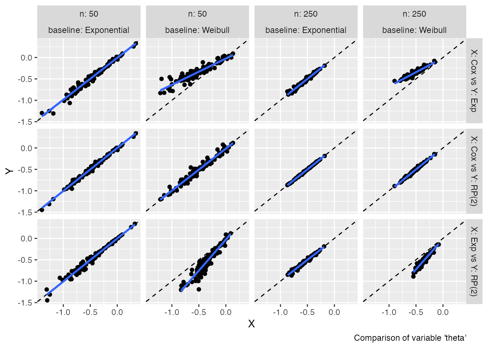

Analogously, if we want to compare standard errors:

``` r

autoplot(s1, type = "se")
#> `geom_smooth()` using formula = 'y ~ x'
```

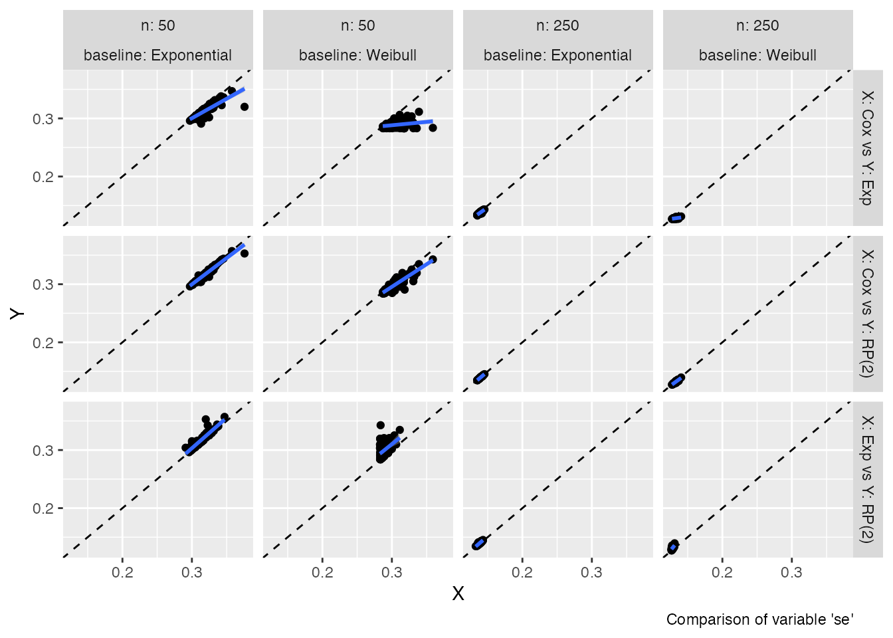

These two plot types allow comparing estimates (and standard errors)
obtained from different methods with ease; in ideal settings, the points
of the scatterplots should lay on the diagonal (dashed line). An
estimated regression line (of `X` vs `Y`, blue line) is superimposed by
default to ease the comparison even more.

In addition to plots comparing estimates and standard errors,
Bland-Altman-type plots are supported as well:

``` r

autoplot(s1, type = "est_ba")
#> `geom_smooth()` using formula = 'y ~ x'
```

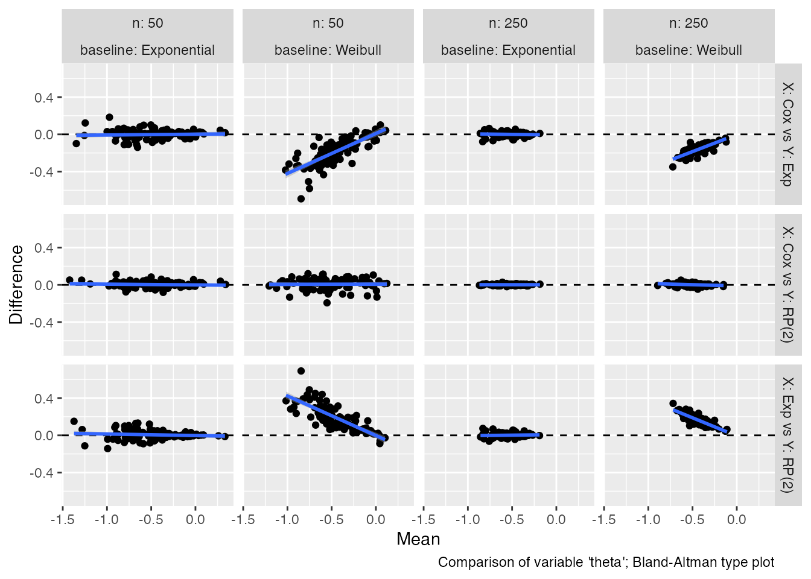

Bland-Altman plots compare the difference between estimates from two
competing methods (on the y-axis) with the mean of the estimates from
the two methods (x-axis). In the ideal scenario, there should be no
trend and all the points from the scatter plot should lay around the
horizontal dashed line. To ease comparison, a regression line is
included here as well. Bland-Altman plots for standard errors could be
obtained by setting the argument `type = "se_ba"`.

### Ridgeline plots

Another way of visually comparing estimates from different methods is
given by ridgeline plots. According to the documentation of the
`ggridges` package
([source](https://cran.r-project.org/package=ggridges/vignettes/introduction.html)),

> Ridgeline plots are partially overlapping line plots that create the
> impression of a mountain range. They can be quite useful for
> visualizing changes in distributions over time or space.

In the settings of simulation studies, we aim to visualise changes in
distribution over data-generating mechanisms.

For instance, say we want to compare estimates across data-generating
mechanisms and methods:

``` r

autoplot(s1, type = "est_ridge")
#> Picking joint bandwidth of 0.077
```

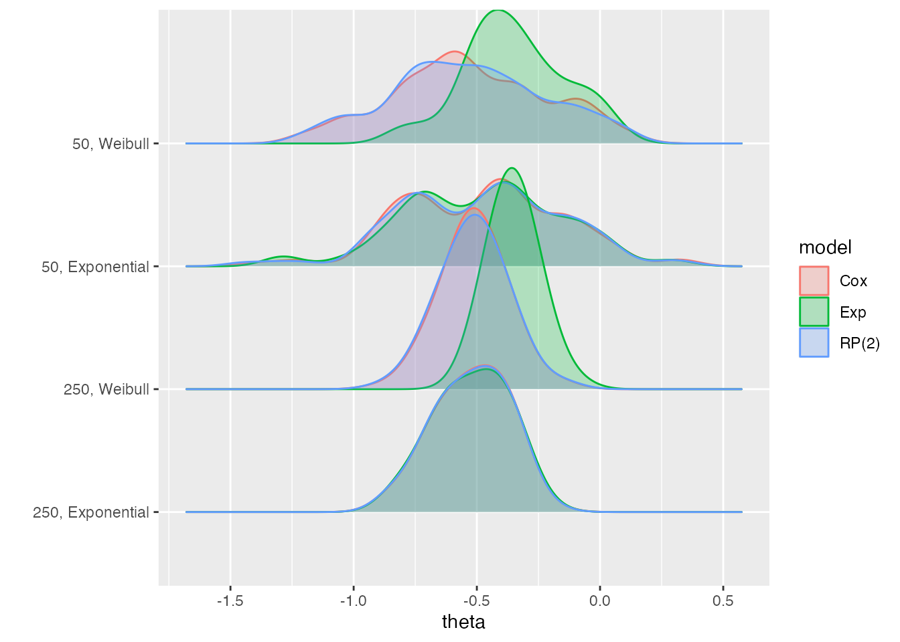

This allows us to see how the estimates from the `Exp` method are
different from the other methods in two of the four data-generating
mechanisms: `50, Weibull` and `250, Weibull`.

To obtain a similar plot for standard errors, call the `autoplot` method
with `type = "se_ridge` instead.

## Lolly plots

Lolly plots are used to present estimates for a given summary statistic
with confidence intervals based on Monte Carlo standard errors (if
calling the `autoplot` method on `summary` objects). They allow to
easily compare methods.

Say we are interested in bias:

``` r

autoplot(summary(s1), type = "lolly", stats = "bias")
```


It is straightforward to identify the exponential model as yielding
biased results when the true baseline hazard is Weibull, irrespectively
of the sample size.

On a relative scale, we can plot *relative bias* as well:

``` r

autoplot(summary(s1), type = "lolly", stats = "rbias")
```

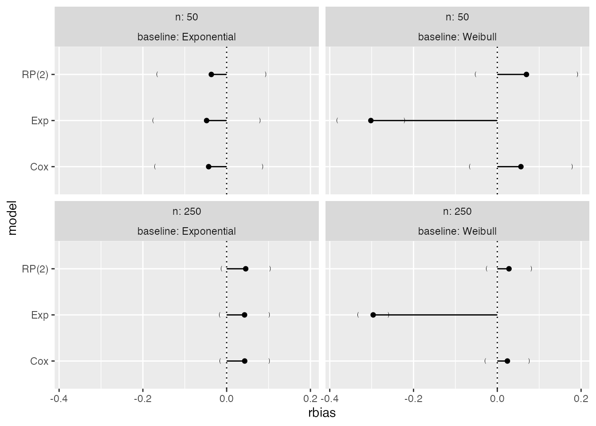

If confidence intervals based on Monte Carlo errors are not required, it
is sufficient to call the `autoplot` method on the `simsum` object:

``` r

autoplot(s1, type = "lolly", stats = "bias")
```

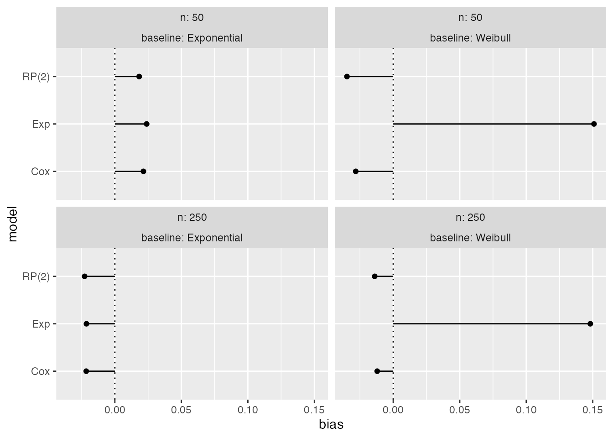

Analogously, for coverage:

``` r

autoplot(summary(s1), type = "lolly", stats = "cover")
```

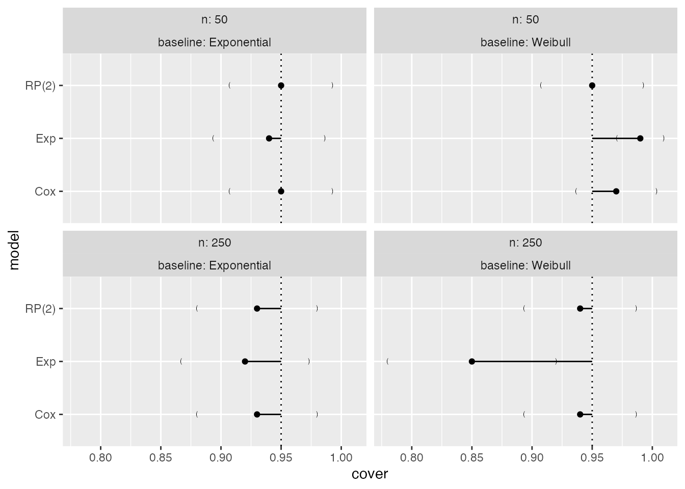

## Forest plots

Forest plots could be an alternative to lolly plots, with similar
interpretation:

``` r

autoplot(s1, type = "forest", stats = "bias")
```

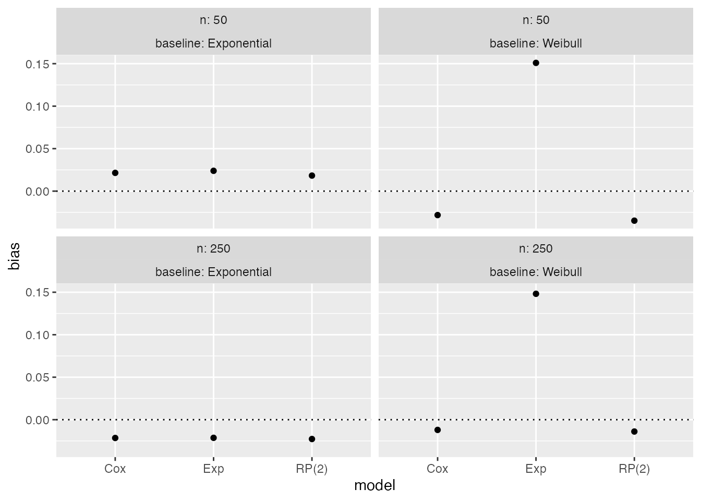

``` r

autoplot(summary(s1), type = "forest", stats = "bias")
```

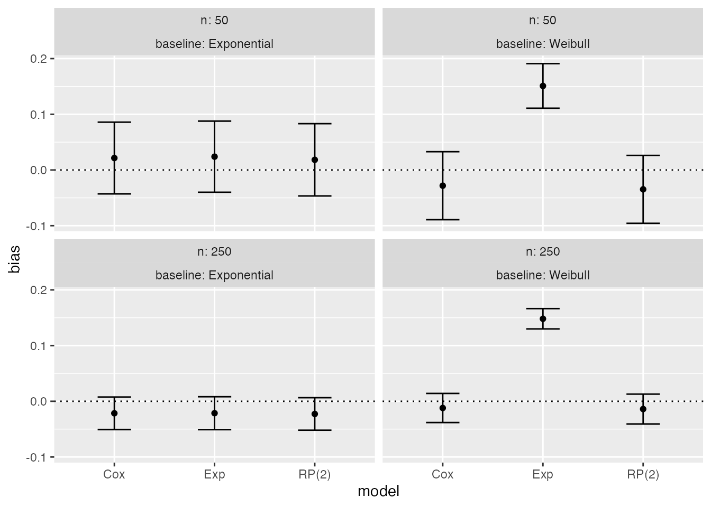

## Zipper plots

Zipper plots (or zip plots), introduced in Morris *et al*. (2019), help
understand coverage by visualising the confidence intervals directly.
For each data-generating mechanism and method, the confidence intervals
are centile-ranked according to their significance against the null
hypothesis H_0: \theta = \theta\_{\text{true}}, assessed via a Wald-type
test. This ranking is used for the vertical axis and is plotted against
the intervals themselves.

When a method has 95% coverage, the colour of the intervals switches at
95 on the vertical axis. Finally, the horizontal lines represent
confidence intervals for the estimated coverage based on Monte Carlo
standard errors.

``` r

autoplot(s1, type = "zip")
```

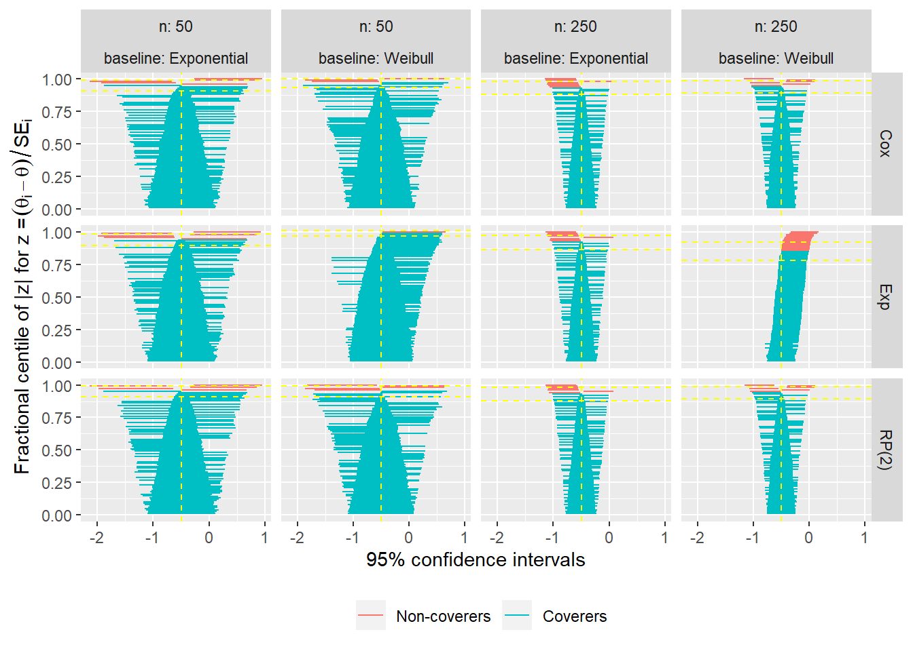

The zipper plot for the exponential model with n = 50 and a true Weibull
baseline hazard shows that coverage is approximately 95%; however, there
are more intervals to the right of \theta = -0.50 than to the left: this
indicates that the model standard errors must be overestimating the
empirical standard error, because coverage is appropriate despite bias.

It is also possible to *zoom* on the top x% of the zip plot to increase
readability, e.g. on the top 30%:

``` r

autoplot(s1, type = "zip", zoom = 0.3)
```

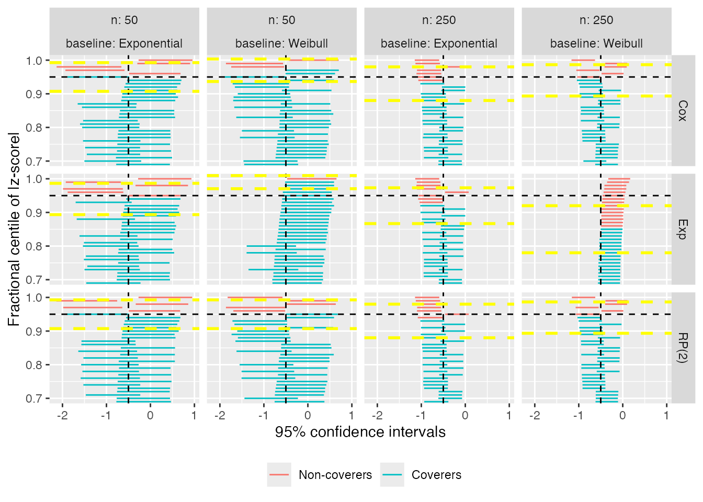

## Heat plots

Heat plots are a new visualisation that we suggest and include here for
the first time. With heat plots, we produce a heat-map-like plot where
the filling of each tile represents a given summary statistic, say bias:

``` r

autoplot(s1, type = "heat", stats = "bias")
```

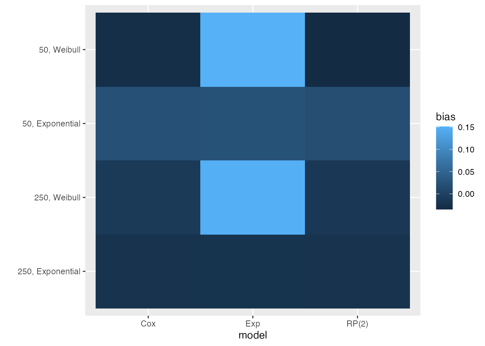

This visualisation type automatically puts all data-generating
mechanisms on the y-axis; by default, the methods are included on the
`x` axis. Therefore, this plot is most useful when a simulation study
includes different methods to be compared and many data-generating
mechanisms. Using a heat plot, it is immediate to identify visually
which method performs better and under which data-generating mechanisms.

By default, heat plots use the default `ggplot` scale for the filling
aesthetic. It is recommended to use a different colour palette with
better characteristics, e.g. the viridis colour palette from
`matplotlib`; see the next section for details on how to do this, and
[here](https://cran.r-project.org/package=viridis/vignettes/intro-to-viridis.html)
for details on the viridis colour palette.

## Contour plots and hexbin plots

Individual point estimates and standard errors could also be plotted
using contour plots or hexbin plots.

Contour plots represent a 3-dimensional surface by plotting constant z
slices (called contours) on a 2-dimensional format. That is, given a
value for z, lines are drawn for connecting the (x, y) coordinates where
the value of z is (relatively) homogenous.

Hexbin plots are useful to represent the relationship of 2 numerical
variables when you have a lot of data points: instead of overlapping,
the plotting window is split in several hexbins, and the number of
points per hexbin is counted. The colour filling denotes then the number
of points.

Both plots provide an alternative to scatter plots when there is a large
number of data points that overlap. Contour plots and hexbin plots can
be easily obtained using the `autoplot` method once again, and using the
argument `type = "est_density"`, `type = "se_density"`,
`type = "est_hex"`, or `type = "se_hex"`. For instance, focussing on
point estimates:

``` r

autoplot(s1, type = "est_density")
#> `geom_smooth()` using formula = 'y ~ x'
```

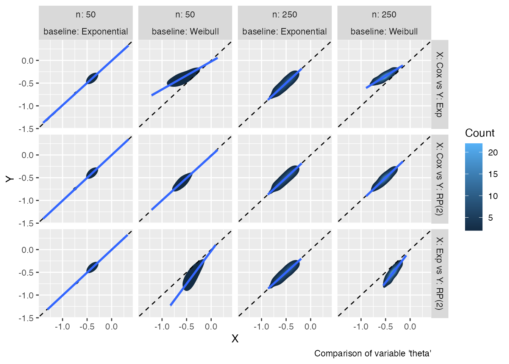

``` r

autoplot(s1, type = "est_hex")
#> `geom_smooth()` using formula = 'y ~ x'
```

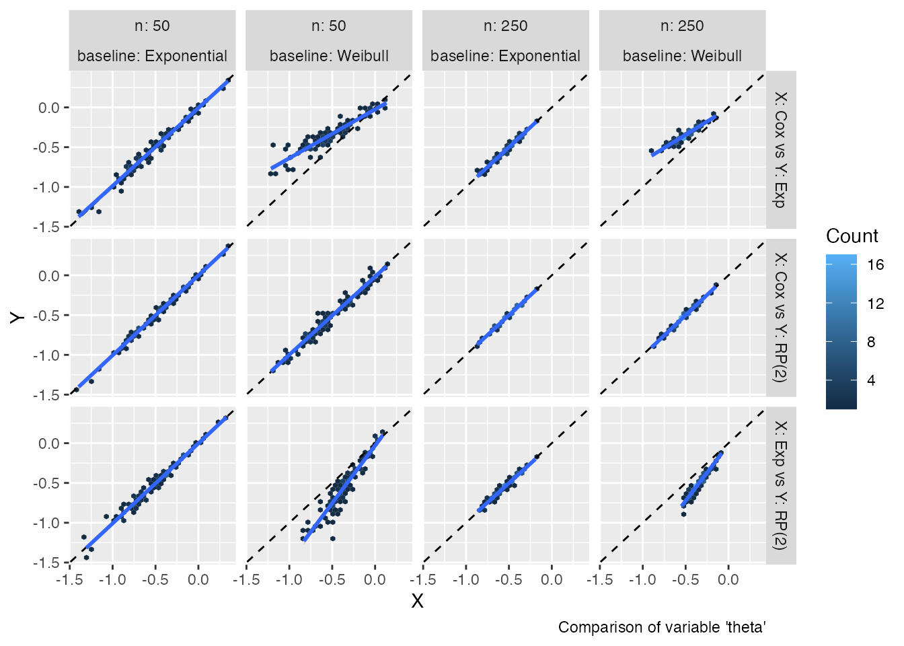

Of course, analogous plots could be obtained for standard errors.

## Custom plotting

All plots produced by `rsimsum` are meant to be quick explorations of
results from Monte Carlo simulation studies: they are not meant to be
final manuscript-like-quality plots (although they can be useful as a
starting point).

Generally, the output of all types of `autoplot` calls are `ggplot`
objects; hence, it should be generally straightforward to customise all
plots. For instance, say we want to add a custom theme:

``` r

autoplot(summary(s1), type = "lolly", stats = "bias") +
  ggplot2::theme_bw()
```

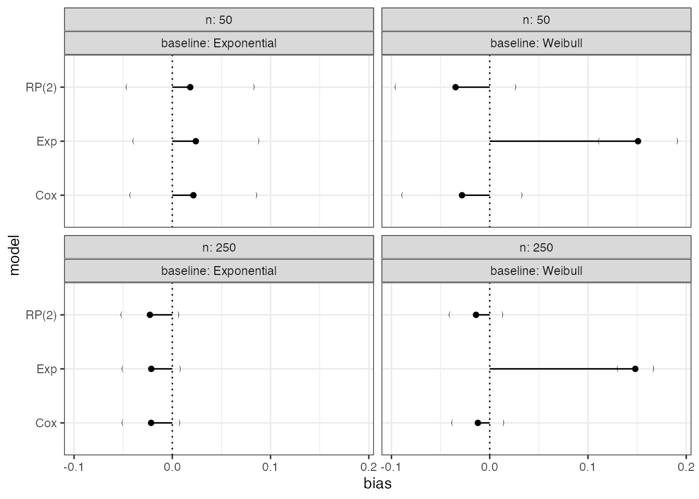

Compare to the default plot:

``` r

autoplot(summary(s1), type = "lolly", stats = "bias")
```

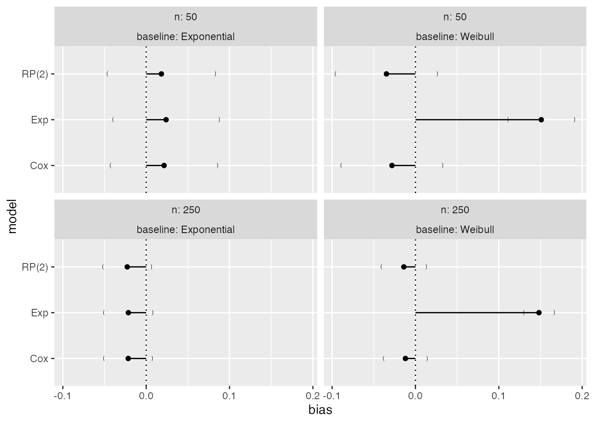

We also mentioned before that the colour palette of heat plots should be
customised. Say we want to use the default viridis colour palette:

``` r

autoplot(s1, type = "heat", stats = "bias") +
  ggplot2::scale_fill_viridis_c()
```

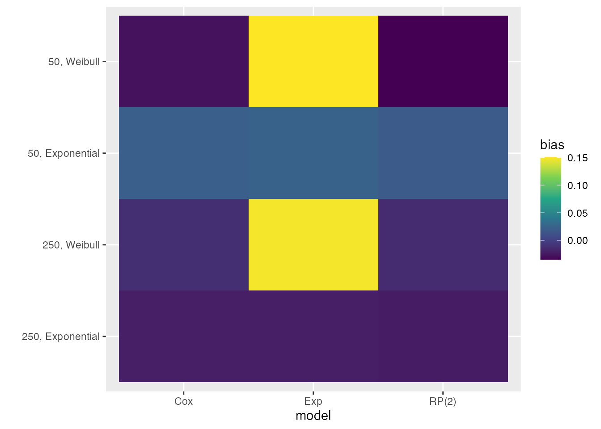

Analogously, say we want to customise the colour palette of ridgeline
plots, again using the viridis colour palette:

``` r

autoplot(s1, type = "est_ridge") +
  scale_fill_viridis_d() +
  scale_colour_viridis_d()
#> Picking joint bandwidth of 0.077
```

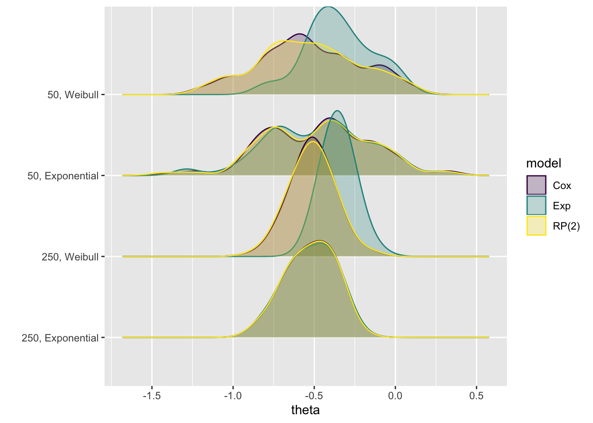
