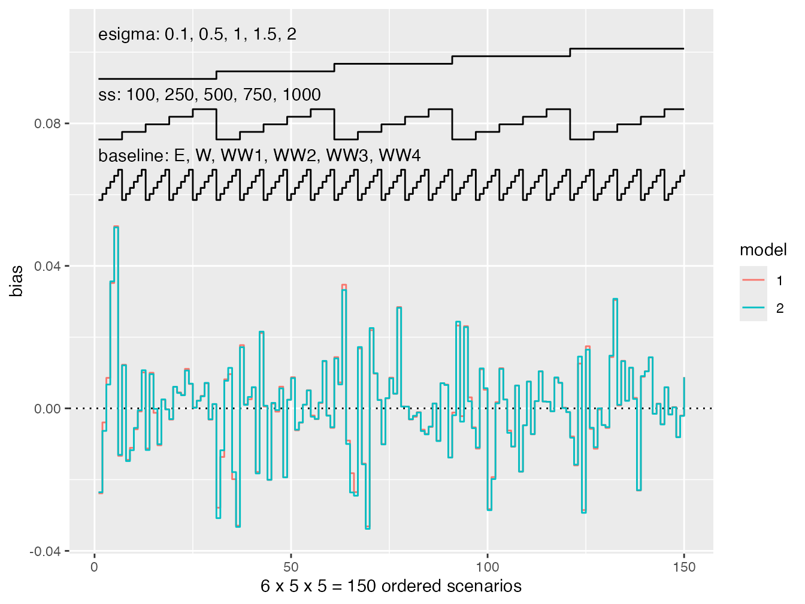

# Nested loop plots

As of version `0.6.0`, `rsimsum` supports the fully automated creation
of nested loop plots (Rücker and Schwarzer, 2014).

``` r

library(rsimsum)
```

A dataset that can be purposefully used to illustrate nested loop plots
is bundled and shipped with `rsimsum`:

``` r

data("nlp", package = "rsimsum")
```

This data set contains the results of a simulation study on survival
modelling with 150 distinct data-generating mechanisms:

``` r

head(nlp)
#>   dgm  i model           b        se baseline  ss beta esigma pars
#> 1   1  1     1  0.17119413 0.2064344        E 100    0    0.1  0.5
#> 2   1  1     2  0.19822898 0.2048353        E 100    0    0.1  0.5
#> 3   1 50     2 -0.03404229 0.2071766        E 100    0    0.1  0.5
#> 4   1 82     1 -0.09263968 0.2040281        E 100    0    0.1  0.5
#> 5   1 82     2 -0.05095914 0.2026813        E 100    0    0.1  0.5
#> 6   1 33     1 -0.17013365 0.2038076        E 100    0    0.1  0.5
```

Further information on the data could be find in the help file
([`?nlp`](https://ellessenne.github.io/rsimsum/reference/nlp.md)).

We can analyse this simulation study using `rsimsum` as usual:

``` r

s <- rsimsum::simsum(
  data = nlp, estvarname = "b", true = 0, se = "se",
  methodvar = "model", by = c("baseline", "ss", "esigma")
)
#> 'ref' method was not specified, 1 set as the reference
s
#> Summary of a simulation study with a single estimand.
#> True value of the estimand: 0 
#> 
#> Method variable: model 
#>  Unique methods: 1, 2 
#>  Reference method: 1 
#> 
#> By factors: baseline, ss, esigma 
#> 
#> Monte Carlo standard errors were computed.
```

Finally, a nested loop plot can be automatically produced via the
`autoplot` method, e.g. for bias:

``` r

library(ggplot2)
autoplot(s, type = "nlp", stats = "bias")
```



However:

1.  Nested loop plots are suited for several DGMs but not for several
    methods;
2.  The decision on how to *nest* the results is subjective - the
    top-level of nesting receives most emphasis;
3.  It gives an *overall* impression, without focusing too much on
    details;
4.  It is cumbersome to incorporate Monte Carlo errors in the plot.

## References

- Rücker, G. and Schwarzer, G. 2014 *Presenting simulation results in a
  nested loop plot*. BMC Medical Research Methodology 14(1)
  \<[doi:10.1186/1471-2288-14-129](https://doi.org/10.1186/1471-2288-14-129)\>
